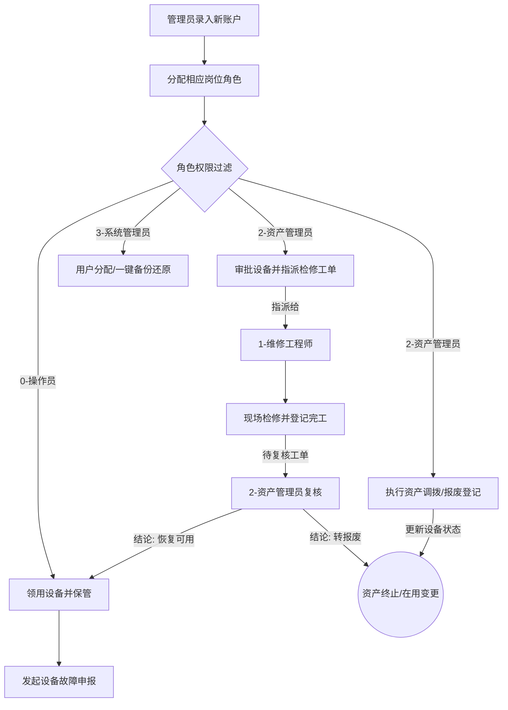

# 国家标准设备管理系统 (EMS) - 项目说明

## 1. 项目定位与目标
本项目是一个用于企事业单位固定资产设备管理的 **全生命周期监管系统**。系统严格遵循国家设备分类编码标准（GB/T 14885），覆盖设备的入库、领用、调拨、检修、报废等核心阶段。

通过引入 **RBAC 四级角色控制** 与 **安全审计/灾备机制**，系统实现了多岗位高效协作、核心数据防越权和灾难一键恢复，全面代替传统的纸质及人工表格台账。

---

## 2. 系统技术栈

| 层次 | 技术选型 | 说明 |
| :--- | :--- | :--- |
| **前端 SPA** | Vue 2.7.x / Vue Router | 采用 Element UI 朴素白灰与科技蓝主视觉风格，Options API 开发模式。 |
| **后端 API** | Java 11 / Spring Boot 2.7.18 | RESTful 接口体系，统一响应体封装， constructor 基于 Lombok 自动注入。 |
| **数据库** | MySQL 8.0 / 5.7+ (InnoDB) | 聚集索引和高频业务二级索引优化，支持物理与逻辑事务回滚。 |
| **底层持久层**| Spring JdbcTemplate + BasicDao | 原生 JDBC 语句封装，追求极简、高执行效能，杜绝 JPA 延迟加载 N+1 问题。 |
| **安全鉴权** | JWT (JSON Web Token) / MD5 | 登录口密码 MD5 传输比对，前后端全局 Token 签名校验拦截。 |

---

## 3. 核心业务模块划分

本系统由九个核心业务板块组成，各板块间相互关联：
1.  **设备台账 (Equipment)**：支持设备录入、编辑、删除与实时折旧资产价值计算。
2.  **检修记录 (Maintenance)**：处理故障报修申报、工程师分派及检修结果登记。
3.  **调拨记录 (Transfer)**：实现资产在各分子公司/部门间的内部透明流转。
4.  **报废记录 (Scrap)**：设备全生命周期的终止确认与报废审批。
5.  **分类管理 (Category)**：维护 GB/T 14885 分类，定制折旧年限与预计残值率。
6.  **单位管理 (Department)**：管理公司的组织架构和使用单位负责人。
7.  **用户权限管理 (User Manage)**：系统管理员查看账号列表、调整员工真实姓名/角色/所属单位、重置用户密码，并可按规则删除停用账号；普通用户可通过右上角入口自助修改本人密码。
8.  **备份与恢复 (Database)**：基于 `mysqldump` 的数据库一键备份及还原，提供容灾应急能力。
9.  **数据看板 (Dashboard) (新)**：实现基于角色的系统监控与待办引导，并作为登录后默认首屏。

---

## 4. 系统演进路线

系统后续演进按“管理可视化 -> 管理闭环 -> 数据治理 -> AI 辅助”的顺序推进，避免在基础审计和数据质量尚未完成前过早引入不可控智能决策。

1. **一期：数据看板 MVP**
   * 建设角色化数据看板，为资产管理员、系统管理员、维修工程师和设备操作员提供不同视角。
   * 通过 KPI 卡片、图表和待办入口，把设备、领用、维修、调拨、报废等数据汇总为管理视图。
   * 对应任务：`docs/4-tasks/features/TASK-011-dashboard/`。

2. **二期：管理闭环增强**
   * 建设操作审计能力，记录设备、领用、维修、调拨、报废、备份恢复等关键操作。
   * 建设设备生命周期详情页，以单台设备为主线聚合基础信息、折旧、保管、领用、维修、调拨、报废和审计时间线。
   * 对应任务：`docs/4-tasks/features/TASK-012-operation-audit-lifecycle/`。

3. **三期：数据治理与运营分析**
   * 增加编号格式校验、状态一致性检查、重复设备检测、长期空闲设备识别和高风险设备清单。
   * 建立资产健康评分和维修成本异常分析，辅助资产管理员进行巡检、调拨和报废评估。
   * 第一版采用实时规则计算，不新增数据库结构，不引入 AI，风险阈值以命名常量固化在后端治理服务中。
   * 对应任务：`docs/4-tasks/features/TASK-013-data-governance-risk/`。

4. **四期：维修流转闭环**
   * 在现有报修、派单与完工登记基础上，补齐“待复核”“复核恢复可用”“复核转报废”状态与处置链路。
   * 将检修业务从“工程师完工即恢复在用”调整为“资产管理员复核后给出最终处置结论”的真实闭环。
   * 对应任务：`docs/4-tasks/features/TASK-014-maintenance-closure-loop/`。

5. **五期：事找人 MVP**
   * 基于数据治理、领用审批和检修闭环结果，建立规则驱动的事件提醒与消息中心，让系统具备“发现问题并找到责任人”的能力。
   * 第一版仅覆盖高风险设备提醒、领用待审批积压提醒和维修单超时提醒，不引入 WebSocket 或外部消息通道。
   * 对应任务：`docs/4-tasks/features/TASK-015-event-notification-mvp/`。

6. **六期：AI 辅助决策**
   * 基于看板、审计日志、生命周期详情和数据治理结果，生成资产运营周报/月报、异常解释和处置建议草案。
   * AI 仅作为解释和建议层，不直接执行审批、报废、恢复数据库等高风险动作。
   * 第一版只生成草案和摘要，不保存 AI 输出，不让 AI 直接访问数据库或调用业务写接口。
   * 对应任务：`docs/4-tasks/features/TASK-016-ai-assisted-reporting/`。

---

## 5. 全局业务流转图

