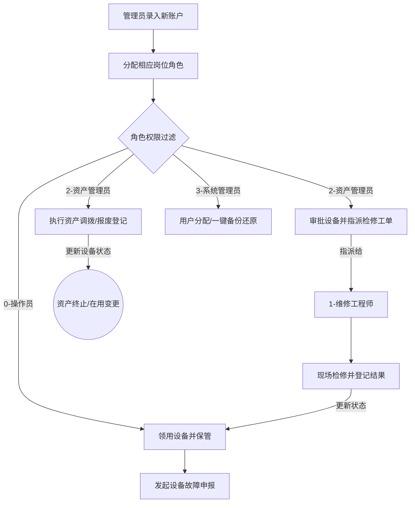

# 国家标准设备管理系统 (EMS) - 项目说明

## 1. 项目定位与目标
本项目是一个用于企事业单位固定资产设备管理的 **全生命周期监管系统**。系统严格遵循国家设备分类编码标准（GB/T 14885），覆盖设备的入库、领用、调拨、检修、报废等核心阶段。

通过引入 **RBAC 四级角色控制** 与 **安全审计/灾备机制**，系统实现了多岗位高效协作、核心数据防越权和灾难一键恢复，全面代替传统的纸质及人工表格台账。

---

## 2. 系统技术栈

| 层次 | 技术选型 | 说明 |
| :--- | :--- | :--- |
| **前端 SPA** | Vue 2.7.x / Vue Router | 采用 Element UI 朴素白灰与科技蓝主视觉风格，Options API 开发模式。 |
| **后端 API** | Java 11 / Spring Boot 2.7.18 | RESTful 接口体系，统一响应体封装， constructor 基于 Lombok 自动注入。 |
| **数据库** | MySQL 8.0 / 5.7+ (InnoDB) | 聚集索引和高频业务二级索引优化，支持物理与逻辑事务回滚。 |
| **底层持久层**| Spring JdbcTemplate + BasicDao | 原生 JDBC 语句封装，追求极简、高执行效能，杜绝 JPA 延迟加载 N+1 问题。 |
| **安全鉴权** | JWT (JSON Web Token) / MD5 | 登录口密码 MD5 传输比对，前后端全局 Token 签名校验拦截。 |

---

## 3. 核心业务模块划分

本系统由八个核心业务板块组成，各板块间相互关联：
1.  **设备台账 (Equipment)**：支持设备录入、编辑、删除与实时折旧资产价值计算。
2.  **检修记录 (Maintenance)**：处理故障报修申报、工程师分派及检修结果登记。
3.  **调拨记录 (Transfer)**：实现资产在各分子公司/部门间的内部透明流转。
4.  **报废记录 (Scrap)**：设备全生命周期的终止确认与报废审批。
5.  **分类管理 (Category)**：维护 GB/T 14885 分类，定制折旧年限与预计残值率。
6.  **单位管理 (Department)**：管理公司的组织架构和使用单位负责人。
7.  **用户权限管理 (User Manage)**：管理员修改员工角色，保障系统边界安全。
8.  **备份与恢复 (Database)**：基于 `mysqldump` 的数据库一键备份及还原，提供容灾应急能力。

---

## 4. 全局业务流转图

