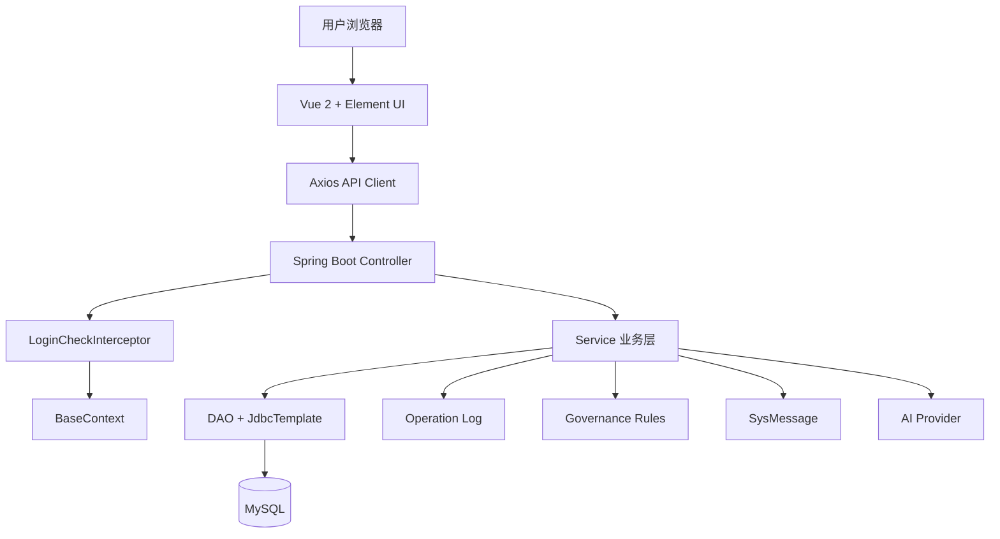

# WEB 开发技术课程设计报告详尽计划书

**目标文件**：`23WEB课程设计报告.doc` 对应的正式课程设计报告  
**项目名称建议**：基于 Spring Boot 与 Vue 的国家标准设备管理系统  
**依据范围**：当前前后端代码、`docs/1-requirements/`、`docs/2-designs/`、`docs/4-tasks/`、git 提交记录、毕业设计说明书结构  
**边界原则**：参照毕业论文结构标准，但不加入课程设计未要求的原创性声明、版权授权、致谢等毕业论文专属内容；不编造代码中不存在的功能。

---

## 1. 报告总结构

### 1.1 封面
需要补齐：
- 题目：基于 Spring Boot 与 Vue 的国家标准设备管理系统
- 姓名、学号、专业班级、学院、指导教师、日期

写作依据：
- `23WEB课程设计报告.doc` 原始封面字段
- `孙佳慧毕业设计说明书.docx` 封面层级与格式

不加入：
- 学位论文原创性声明
- 学位论文版权使用授权书
- 毕业论文致谢

### 1.2 摘要
建议写 250-400 字，覆盖：
- 固定资产设备管理痛点：纸质台账、设备流转不透明、检修与报废缺乏闭环、权限边界不清晰。
- 系统目标：实现设备全生命周期管理、RBAC 权限控制、数据看板、审计追踪、治理分析、消息提醒和 AI 草案生成。
- 技术方案：Spring Boot 2.7.18、Java 11、Vue 2、Element UI、MySQL、JdbcTemplate、JWT。
- 实现结果：完成登录注册、设备台账、领用审批、检修闭环、报废调拨、数据治理、消息中心、AI 助手等模块。

关键词建议：
- 设备管理
- Spring Boot
- Vue
- RBAC
- MySQL
- 数据治理
- AI 辅助报告

### 1.3 目录
按最终章节自动生成或手工整理：
1. 绪论
2. 相关技术介绍
3. 系统需求分析
4. 系统设计
5. 系统实现
6. 系统测试
7. 课程设计总结
8. 参考文献
9. 附录

---

## 2. 第 1 章 绪论

### 2.1 项目背景
写作要点：
- 企事业单位固定资产数量增加后，传统表格管理难以支撑跨部门流转、维修、报废和审计。
- 设备管理需要覆盖入库、领用、调拨、检修、报废等完整生命周期。
- 权限控制是设备管理系统的核心要求，不同角色必须拥有不同视角和操作边界。

资料来源：
- `docs/1-requirements/project_overview.md`
- `docs/1-requirements/requirements_analysis.md`

### 2.2 设计意义
写作要点：
- 提高设备台账准确性。
- 减少人工审批和线下流转。
- 通过审计日志提升可追溯性。
- 通过数据治理发现风险设备和异常成本。
- 通过消息中心把系统发现的问题路由给责任人。
- 通过 AI 辅助报告降低运营分析文本整理成本。

### 2.3 本文主要内容
参考毕业论文写法，但改为课程设计口径：
- 第 1 章介绍背景和意义。
- 第 2 章介绍技术栈。
- 第 3 章分析角色、功能、非功能和权限需求。
- 第 4 章设计系统架构、模块、数据库、接口和核心业务流程。
- 第 5 章说明核心模块实现。
- 第 6 章进行系统测试。
- 最后总结课程设计过程和不足。

---

## 3. 第 2 章 相关技术介绍

### 3.1 Java 11 与 Spring Boot 2.7.18
写作要点：
- Java 作为后端业务开发语言。
- Spring Boot 简化配置、内嵌 Web 容器、便于构建 RESTful API。
- Controller、Service、DAO 分层结构。

代码依据：
- `equipment_system_management/src/main/java/com/weiqiang/`
- `equipment_system_management/AGENTS.md`

### 3.2 Vue 2 与 Element UI
写作要点：
- Vue 2 Options API 构建单页后台管理系统。
- Element UI 提供表格、表单、弹窗、标签、分页等组件。
- Vue Router 实现页面路由和前端权限守卫。

代码依据：
- `equipment-web/src/router/index.js`
- `equipment-web/src/views/`
- `equipment-web/src/api/`

### 3.3 MySQL 与 JdbcTemplate
写作要点：
- MySQL 保存设备、用户、领用、检修、报废、调拨、审计、消息等结构化数据。
- 后端使用 `JdbcTemplate + BasicDao`，不使用 JPA/Hibernate。
- DAO 层通过参数化 SQL 执行查询，降低 SQL 注入风险。

资料来源：
- `docs/2-designs/db_schema.md`
- `equipment_system_management/src/main/java/com/weiqiang/dao/`

### 3.4 JWT 与 RBAC
写作要点：
- 登录成功后后端签发 JWT。
- 前端存储 token 和 role。
- 后端拦截器验证 token，并写入 `BaseContext`。
- `@RequiresRoles` 注解实现接口级角色控制。

代码依据：
- `LoginCheckInterceptor.java`
- `SecurityAspect.java`
- `RequiresRoles.java`
- `JwtUtils.java`

### 3.5 ECharts、消息中心与 AI 辅助
写作要点：
- 数据看板和治理页面可用图表展示资产状态、风险分布和维修趋势。
- 消息中心采用规则驱动和页面拉取，不使用 WebSocket。
- AI 助手只生成草案和摘要，不执行业务写操作。

资料来源：
- `docs/2-designs/ui_prototype.md`
- `docs/2-designs/architecture.md`
- `AiAssistantController.java`
- `SysMessageController.java`

---

## 4. 第 3 章 系统需求分析

### 4.1 角色需求
必须写清四级角色：

| 角色 | 主要职责 | 核心权限 |
| :--- | :--- | :--- |
| 设备操作员 Role 0 | 设备使用人、报修人 | 查看本人设备、申请领用、退还、报修、查看本人消息 |
| 维修工程师 Role 1 | 维修执行人 | 查看工单、登记完工、查看维修消息 |
| 资产管理员 Role 2 | 业务管理者 | 设备入库、分配、调拨、报废、检修指派和复核、治理分析、AI 草案 |
| 系统管理员 Role 3 | 系统运维与审计 | 用户管理、数据库备份恢复、审计日志、全局只读视角 |

资料来源：
- `docs/2-designs/role_positioning.md`
- `equipment-web/src/router/index.js`
- 后端 Controller `@RequiresRoles`

### 4.2 功能需求
建议分模块写：

1. 登录与注册
   - 登录校验用户名和密码。
   - 注册要求用户名、密码、真实姓名、所属单位。
   - 注册后默认 Role 0。

2. 用户权限管理
   - 系统管理员查看用户列表。
   - 编辑真实姓名、角色、所属单位。
   - 管理员角色单位清空。
   - 有保管设备时阻断单位变更。
   - 重置他人密码，不能通过该入口重置自己。

3. 设备台账
   - 设备增删改查、分页检索、导出。
   - 折旧计算。
   - 生命周期详情聚合。
   - 当前代码中设备状态为“在用 / 维修 / 报废”，可领用设备为“在用且无保管人”。

4. 领用审批
   - 发起申请、撤回申请、审批同意/拒绝、退还、直接分配。
   - 流水状态：0-待审批、1-已同意、2-已拒绝、3-已撤回、4-已退还、5-直接分配。

5. 检修闭环
   - 报修、指派、维修中、待复核、复核恢复可用、复核转报废。
   - 工单状态：0-待指派、1-维修中、2-待复核、3-已复核可用、4-已复核转报废。

6. 调拨、报废、分类、单位
   - 资产管理员执行业务维护。
   - 系统管理员更多是只读审计视角。

7. 数据看板
   - 不同角色展示不同 KPI、图表和待办。

8. 操作审计与生命周期详情
   - 记录关键操作。
   - 单设备详情聚合多业务流水。

9. 数据治理
   - 质量问题、风险等级、长期无保管人设备、维修成本异常。

10. 消息中心
   - 高风险设备、待审批积压、维修超时。
   - 未读、已读、事件详情、跳转处理。

11. AI 辅助报告
   - 资产运营周报/月报草案。
   - 单设备生命周期摘要。
   - Provider 未配置时优雅失败。

### 4.3 非功能需求
建议写：
- 安全性：JWT、RBAC、单位隔离、服务端校验。
- 一致性：领用、退还、检修、报废等多表操作依赖事务。
- 可维护性：前后端分层、API 模块化、DAO 封装。
- 易用性：Element UI、角色菜单、空状态、消息提示。
- 可审计性：`operation_log` 追加式记录。

### 4.4 图表要求
必须准备：
- 用例图：四类角色和核心用例。
- 数据流图：登录、设备管理、领用审批、检修闭环、消息生成。
- 权限矩阵表：可直接由 `role_positioning.md` 改写。

---

## 5. 第 4 章 系统设计

### 5.1 总体架构设计
建议图：



说明重点：
- 前端负责页面交互和路由守卫。
- 后端负责鉴权、业务规则、事务和数据隔离。
- 数据库保存核心业务数据。
- AI Provider 仅作为草案生成外部能力。

### 5.2 功能模块设计
建议模块图：
- 认证与权限模块
- 用户管理模块
- 设备台账模块
- 领用审批模块
- 检修闭环模块
- 调拨报废模块
- 分类单位模块
- 数据看板模块
- 审计与生命周期模块
- 数据治理模块
- 消息中心模块
- AI 辅助模块
- 数据备份恢复模块

### 5.3 数据库设计
核心表：
- `sys_user`
- `department`
- `category`
- `equipment`
- `t_equipment_claim`
- `maintenance_record`
- `transfer_record`
- `scrap_record`
- `operation_log`
- `sys_message`

必须画 E-R 图：
- 用户与单位
- 设备与单位、分类、保管人
- 设备与领用、维修、调拨、报废
- 操作日志与业务对象
- 消息与接收人、关联业务对象

### 5.4 接口设计
报告中不需要逐一展开所有 JSON，但要列核心接口表：
- 用户：登录、注册、用户列表、编辑资料、重置密码、改密、删除用户。
- 设备：列表、详情、新增、修改、删除、导出、折旧、生命周期详情。
- 领用：申请、撤回、审批、退还、列表。
- 检修：报修、指派、完工、复核。
- 治理：治理总览、风险设备列表。
- 消息：列表、未读数、单条已读、全部已读。
- AI：报告草案、设备摘要。

资料来源：
- `docs/2-designs/api_contract.md` 的“接口索引”章节。

### 5.5 核心时序图
至少准备 4 张：

1. 登录鉴权时序图
   - 用户提交账号密码。
   - 后端 MD5 校验。
   - JWT 签发。
   - 后续请求携带 token。
   - 拦截器写入 BaseContext。

2. 领用审批时序图
   - 操作员申请。
   - 系统校验设备状态、保管人、单位。
   - 创建待审批流水。
   - 资产管理员审批。
   - 写入保管人和审批状态。

3. 检修闭环时序图
   - 操作员报修。
   - 资产管理员指派。
   - 维修工程师完工。
   - 资产管理员复核。
   - 设备恢复可用或转报废。

4. AI 报告生成时序图
   - 用户点击生成。
   - 后端读取看板和治理摘要。
   - 后端裁剪上下文。
   - 调用 AI Provider。
   - 返回 Markdown 草案。

---

## 6. 第 5 章 系统实现

### 6.1 登录注册与 RBAC 实现
代码引用：
- `UserController.java`
- `UserServiceImpl.java`
- `LoginCheckInterceptor.java`
- `SecurityAspect.java`
- `router/index.js`
- `UserLogin.vue`
- `UserRegister.vue`

关键说明：
- 密码使用 MD5 摘要后与数据库比对。
- JWT 中包含用户 ID、用户名、角色、真实姓名和单位。
- 拦截器实时加载最新单位，避免旧 Token 带来错误单位边界。

### 6.2 设备台账与生命周期实现
代码引用：
- `EquipmentController.java`
- `EquipmentServiceImpl.java`
- `EquipmentDao.java`
- `Equipment.vue`
- `equipment/Detail.vue`

关键说明：
- 动态筛选、分页、导出。
- 折旧计算。
- 生命周期详情聚合领用、维修、调拨、报废、审计。

### 6.3 领用审批实现
代码引用：
- `EquipmentClaimController.java`
- `EquipmentClaimServiceImpl.java`
- `EquipmentClaimDao.java`
- `EquipmentClaim.vue`

关键说明：
- 可申请条件是“在用且无保管人”。
- 待审批流水防止重复申请。
- 审批同意后写入 `custodian`。
- 退还后清空 `custodian` 并写退还流水。

### 6.4 检修闭环实现
代码引用：
- `MaintenanceRecordController.java`
- `MaintenanceRecordServiceImpl.java`
- `MaintenanceRecordDao.java`
- `MaintenanceRecord.vue`

关键说明：
- 已报废设备禁止报修。
- 维修中设备禁止重复报修。
- 操作员只能报修本人保管设备。
- 资产管理员执行指派和复核。

### 6.5 数据看板、治理和消息中心实现
代码引用：
- `DashboardController.java`
- `GovernanceController.java`
- `SysMessageController.java`
- `DashboardServiceImpl.java`
- `GovernanceServiceImpl.java`
- `SysMessageServiceImpl.java`
- `Dashboard.vue`
- `DataGovernance.vue`
- `MessageCenter.vue`

关键说明：
- 看板按角色返回不同数据。
- 治理规则识别风险和质量问题。
- 消息中心按当前用户过滤，支持未读数和已读操作。

### 6.6 AI 辅助实现
代码引用：
- `AiAssistantController.java`
- `AiAssistantServiceImpl.java`
- `AiReportDraftVO.java`
- `AiEquipmentSummaryVO.java`
- `AiAssistant.vue`
- `api/aiAssistant.js`

关键说明：
- 报告草案使用看板和治理摘要。
- 设备摘要使用生命周期详情。
- 未配置 API Key 时返回明确错误。
- AI 不直接写数据库，不调用审批或报废等接口。

### 6.7 备份恢复与系统审计实现
代码引用：
- `DatabaseController.java`
- `DBUtils.java`
- `DBBackupProperties.java`
- `OperationLogController.java`
- `OperationLogServiceImpl.java`
- `DataBackup.vue`
- `AuditLog.vue`

关键说明：
- 系统管理员可备份、恢复、查看备份文件和配置。
- 操作审计记录关键业务动作。

---

## 7. 第 6 章 系统测试

### 7.1 功能测试用例
建议表格字段：
- 编号
- 测试模块
- 前置条件
- 操作步骤
- 预期结果
- 实际结果

必须覆盖：
- 登录成功和失败。
- 注册缺少单位、用户名重复。
- 设备新增、查询、编辑、删除。
- 领用申请、重复申请、审批同意、审批拒绝、退还。
- 检修报修、指派、完工、复核恢复、复核转报废。
- 数据治理列表筛选。
- 消息已读和跳转。
- AI 未配置失败提示、配置后生成草案。

### 7.2 权限测试用例
必须覆盖：
- 未登录访问业务页面跳转登录。
- Role 0 访问用户管理被拦截。
- Role 1 不能访问调拨、报废、治理、AI。
- Role 2 不能访问数据库备份恢复和用户管理。
- Role 3 可访问用户管理、备份恢复、审计。
- 跨单位审批、跨单位修改设备被后端拒绝。

### 7.3 接口测试
建议依据：
- `docs/2-designs/api_contract.md`
- 后端 Maven 测试
- 浏览器联调

### 7.4 边界测试
必须覆盖：
- 已报废设备禁止报修、领用、调拨。
- 维修中设备禁止重复报修。
- 有保管设备的用户不能随意变更单位。
- 用户删除时保管设备自动清退，但未完结工单阻断删除。
- AI Provider 未配置时不影响非 AI 功能。

### 7.5 验证命令
后端：

```powershell
cd equipment_system_management
mvn test
```

前端：

```powershell
cd equipment-web
npm run lint
```

说明：
- 当前任务只改文档，不改运行代码；正式报告测试章节应记录最近一次实际运行结果和截图证据。

---

## 8. 运行效果截图清单

至少准备以下截图：

1. 登录页
2. 注册页
3. 数据看板首页
4. 设备台账列表
5. 设备新增/编辑弹窗
6. 设备生命周期详情页
7. 领用审批页面
8. 检修记录页面
9. 检修复核弹窗
10. 调拨记录页面
11. 报废记录页面
12. 分类管理页面
13. 单位管理页面
14. 用户权限管理页面
15. 数据备份恢复页面
16. 操作审计日志页面
17. 数据治理页面
18. 消息中心页面
19. AI 助手页面
20. AI 报告导出或打印效果

截图注意：
- 不展示真实密码、token、API Key。
- 如果页面含个人姓名，使用测试账号或脱敏数据。
- 每张图配 1-2 句说明，说明页面用途和关键交互。

---

## 9. 5 分钟演示视频脚本

### 9.1 时间分配
- 0:00-0:30 项目介绍与技术栈
- 0:30-1:00 登录注册和角色菜单
- 1:00-1:50 设备台账、折旧和生命周期详情
- 1:50-2:40 领用审批和检修复核闭环
- 2:40-3:20 数据看板、数据治理和消息中心
- 3:20-4:00 AI 报告草案和设备摘要
- 4:00-4:40 后端/前端项目结构说明
- 4:40-5:00 总结创新点和安全边界

### 9.2 讲解重点
- 本项目不是简单 CRUD，而是围绕设备生命周期做了角色隔离、状态流转、审计和治理。
- AI 只是辅助生成草案，不替代人工审批。
- 消息中心是规则驱动的“事找人”能力。
- 系统管理员和资产管理员职责分离。

---

## 10. 参考文献计划

不少于 10 篇，建议方向：

1. Spring Boot 官方文档或教材
2. Vue.js 官方文档或教材
3. MySQL 数据库设计相关教材
4. RBAC 权限控制相关论文或资料
5. JWT 认证机制相关资料
6. 企业固定资产管理系统相关论文
7. 设备全生命周期管理相关论文
8. 前后端分离架构相关资料
9. 数据治理或数据质量管理相关论文
10. AI 辅助决策或大模型应用安全边界相关资料
11. Element UI 官方文档
12. ECharts 官方文档

注意：
- 参考文献不要写不存在的文章。
- 至少包含 2-3 篇中文论文或教材。
- 技术文档类参考文献格式要统一。

---

## 11. 附录计划

### 附录 A：项目目录结构
列出：
- `equipment_system_management/src/main/java/com/weiqiang/controller`
- `equipment_system_management/src/main/java/com/weiqiang/service`
- `equipment_system_management/src/main/java/com/weiqiang/dao`
- `equipment_system_management/src/main/java/com/weiqiang/pojo`
- `equipment-web/src/views`
- `equipment-web/src/api`
- `equipment-web/src/router`

### 附录 B：核心接口清单
直接整理自：
- `docs/2-designs/api_contract.md` 的“接口索引”章节

### 附录 C：数据库核心表
直接整理自：
- `docs/2-designs/db_schema.md`

### 附录 D：git 提交演进摘要
按阶段写：
- 初始化项目文档与 JWT。
- 登录注册和 RBAC。
- 用户管理和单位绑定。
- 设备领用审批。
- 审计和生命周期。
- 数据治理。
- 检修闭环。
- 消息中心。
- AI 辅助报告。
- UI/UX 收尾和导出清洗。

---

## 12. 最终验收清单

- [ ] 报告覆盖课程设计模板要求的所有内容。
- [ ] 报告没有加入毕业论文专属声明类章节。
- [ ] 所有功能描述都能在代码或 docs 中追溯。
- [ ] 不再把“闲置”写成数据库设备状态。
- [ ] 权限边界写清前端路由守卫和后端强校验。
- [ ] AI 辅助只写草案生成，不写自动决策。
- [ ] 至少 10 篇参考文献。
- [ ] 运行效果截图覆盖核心模块。
- [ ] 5 分钟视频脚本控制在时间内。
- [ ] 不展示密码、Token、API Key、数据库账号等敏感信息。
