<!-- 
写作依据：
1. 项目文档目录 docs/1-requirements/，docs/2-designs/
2. 项目前后端真实代码结构与 API 契约
3. 23WEB课程设计报告-converted.docx (官方样式模板)
4. 孙佳慧毕业设计说明书.docx (学术论文结构参考)
-->

# 《WEB开发技术课程设计报告》

**项目名称**：基于 Spring Boot 与 Vue 的国家标准设备管理系统  
**学生姓名**：[您的姓名]  
**学    号**：[您的学号]  
**专业班级**：[专业班级]  
**所属学院**：[所属学院]  
**指导教师**：[指导老师姓名]  
**完成日期**：2026年6月14日  

---

## 摘要

随着企事业单位固定资产设备数量的快速增长，传统的以纸质台账或单机表格为核心的管理模式已无法满足现代资产精细化运营的需求。设备资产在采购入库、科室领用、调拨迁移、维保检修到最终报废鉴定的全生命周期中，常面临流转不透明、操作缺乏审计追踪、设备质量与风险难以治理等痛点。为此，本文设计并实现了一套基于 Spring Boot 与 Vue 框架的“国家标准设备管理系统”。

系统严格遵循国家资产管理规范，设计了细粒度基于角色的访问控制（RBAC）模型，实现了操作员、维保工程师、资产管理员与系统管理员之间的权责隔离与协同工作。系统后端基于 Spring Boot 2.7.18 框架和 Java 11 进行构建，使用 JdbcTemplate 进行轻量级、安全的数据库访问，利用 JWT 机制实现无状态状态的会话鉴权；前端采用 Vue 2 与 Element UI 构建单页应用，引入 ECharts 实现资产数据可视化。在核心业务流程中，系统实现了基于事务控制的设备领用与退还审批流、维保报修-指派-完工-复核的闭环检修工作流，同时设计了规则驱动的消息中心（事找人机制）以及高风险资产的自动治理分析模型。此外，系统集成了 AI 辅助接口，为资产管理员提供运营分析报告草案及设备生命周期详情的智能摘要，提升了资产运营效率。测试表明，系统在权限隔离、并发一致性控制和安全审计方面均达到预期要求，运行稳定可靠。

**关键词**：设备生命周期管理；Spring Boot；Vue.js；RBAC；数据治理；AI 辅助分析

---

## Abstract

With the rapid growth of fixed assets and equipment in enterprises and public institutions, the traditional management model centered on paper accounts or standalone spreadsheets can no longer meet the needs of modern refined asset operations. Equipment assets face pain points such as opaque circulation, lack of audit tracking, and difficulty in managing equipment quality and risks throughout their lifecycle—from procurement and storage, department claiming, transfer and migration, maintenance and repair, to final scrap appraisal. Therefore, this paper designs and implements a "National Standard Equipment Management System" based on Spring Boot and Vue frameworks.

Strictly adhering to national asset management standards, the system designs a fine-grained four-level Role-Based Access Control (RBAC) model, realizing responsibility isolation and collaborative work among operators, maintenance engineers, asset managers, and system managers. The backend of the system is built on the Spring Boot 2.7.18 framework and Java 11, utilizing JdbcTemplate for lightweight and secure database access, and using JWT mechanism for stateless session authentication. The frontend employs Vue 2 and Element UI to construct a single-page application, with ECharts integrated for asset data visualization. In core business processes, the system implements transaction-controlled equipment claiming and returning approval workflows, and a closed-loop maintenance workflow of "reporting - dispatching - completion - review". Meanwhile, a rule-driven message center (event-seeking-person mechanism) and an automated governance analysis model for high-risk assets are designed. In addition, the system integrates AI assistant interfaces to provide asset managers with draft operation analysis reports and intelligent summaries of equipment lifecycle details, improving asset operation efficiency. Tests show that the system meets expectations in privilege isolation, concurrency consistency control, and security auditing, running stably and reliably.

**Keywords**: Equipment Lifecycle Management; Spring Boot; Vue.js; RBAC; Data Governance; AI-assisted Analysis

---

## 目录

* [第 1 章 绪论](#第-1-章-绪论)
* [第 2 章 相关技术介绍](#第-2-章-相关技术介绍)
* [第 3 章 系统需求分析](#第-3-章-系统需求分析)
* [第 4 章 系统设计](#第-4-章-系统设计)
* [第 5 章 系统实现](#第-5-章-系统实现)
* [第 6 章 系统测试](#第-6-章-系统测试)
* [第 7 章 课程设计总结](#第-7-章-课程设计总结)
* [参考文献](#参考文献)
* [附录](#附录)

---

## 第 1 章 绪论

### 1.1 项目背景

在现代企事业单位与政府机构的日常运营中，固定资产设备（如 IT 设备、实验仪器、办公设施等）占用了大量的资金和空间资源。随着组织规模的不断扩大，资产设备的数量和种类呈爆发式增长，传统的手工登记、单机版 Excel 表格或纸质台账等管理模式的弊端日益凸显。这些陈旧的管理手段往往面临着以下严峻的挑战：
1.  **账实不符与流转不透明**：设备在不同科室、不同人员之间的领用、调拨、退还等环节缺乏实时的在线记录，极易造成资产遗失，且难以追踪当前责任人。
2.  **生命周期脱节与维保不闭环**：设备的采购入库、故障报修、工程师派单、完工登记到最终复核报废，各阶段信息相互孤立，导致设备带病运行或资产过度闲置，检修过程缺乏监管与审核闭环。
3.  **安全合规与权限控制薄弱**：设备台账、审计日志等高价值或敏感数据的访问缺乏细粒度的角色权限控制，任何用户均能随意改动关键状态，无法满足国家对资产安全与合规审计的要求。
4.  **运营风险与治理决策缺乏支持**：管理层无法直观地掌握设备整体的折旧情况、闲置状态、长期未维护或频繁故障等数据治理层面的风险，缺乏智能化的报告整理和辅助决策工具。

因此，开发一套满足国家资产管理规范、全生命周期可追溯、细粒度 RBAC 权限控制且具备数据治理与 AI 决策辅助能力的设备管理系统，成为提升组织资产管理效率的迫切需求。

### 1.2 设计意义

本系统的研发与实现具有重要的现实意义和学术应用价值：
1.  **精细化全生命周期追踪**：通过将设备状态划分为“在用”、“维修”和“报废”，结合基于数据库事务控制的领用流转及检修闭环，实现了设备“入库-分配-使用-报修-复核-报废”一站式全生命周期的无缝监控，确保资产账实相符。
2.  **细粒度的 RBAC 隔离与安全合规**：设计并实现了包含设备操作员、维保工程师、资产管理员和系统管理员在内的四级权限模型，在前端通过路由守卫进行界面级隔离，在后端通过 AOP 切面及拦截器对操作单位及接口权限实施强校验，确保跨单位资产数据绝对隔离，防止非授权越权操作。
3.  **多维数据治理与事找人机制**：引入数据治理分析模型，自动筛查长期无保管人设备、高频故障设备及维修成本异常指标，并通过系统规则引擎自动生成事件通知推送到相关角色的消息中心，将“人找事”的管理模式转变为“事找人”的智能主动服务。
4.  **AI 辅助运营报告决策**：通过集成大语言模型（LLM）接口，系统能够根据设备台账与治理摘要自动撰写资产运营周报、月报草案，并对单设备的生命周期进行智能摘要提炼，极大减轻了管理员整理报告的文本工作量，提升了信息化管理水平。

### 1.3 本文主要内容

本报告详细记录了该“国家标准设备管理系统”的设计与实现全过程，具体章节组织如下：
*   **第 1 章 绪论**：主要阐述固定资产管理系统的开发背景、当前行业痛点、本系统设计的核心意义及论文的整体组织结构。
*   **第 2 章 相关技术介绍**：对本系统后端（Java 11、Spring Boot 2.7.18、JdbcTemplate、JWT、AOP）、前端（Vue 2、Element UI、ECharts）以及大模型 API 的应用进行原理性介绍。
*   **第 3 章 系统需求分析**：从多角色用例、功能模块边界、非功能性需求（安全性、性能、一致性等）和权限控制矩阵四个维度开展细致的需求剖析。
*   **第 4 章 系统设计**：展示系统整体的 MVC/前后端分离三层架构、功能模块树、数据库核心表结构 E-R 关系设计、核心 API 契约和业务流时序交互图。
*   **第 5 章 系统实现**：重点展示认证鉴权、设备台账、领用审批流、检修闭环工作流、数据治理及消息推送、AI 辅助草案生成、数据库备份恢复等核心模块的代码实现与设计考量。
*   **第 6 章 系统测试**：设计包含功能测试、越权拦截测试、边界状态流转测试及接口单元测试在内的完整测试大纲，记录测试步骤与运行结果。
*   **第 7 章 课程设计总结**：总结系统开发过程中的技术收获，指出目前实现的系统局限，并规划未来的优化升级方向。

---

## 第 2 章 相关技术介绍

### 2.1 Java 11 与 Spring Boot 2.7.18 架构

后端开发语言选用 Java 11，该版本作为长期支持版本（LTS），提供了高度稳定的垃圾回收器、局部变量类型推断以及增强的集合 API，极大地提升了服务端业务逻辑的运行效率和代码可读性。
系统后端基于 Spring Boot 2.7.18 框架构建。Spring Boot 通过其特有的自动装配（Auto-Configuration）和起步依赖（Starter POMs）机制，屏蔽了传统 Spring 繁琐的 XML 配置，极大地缩减了项目的搭建与构建周期。在本系统中，后端核心架构采用经典的 Controller-Service-DAO 三层分层模式：
*   **Controller 层**：负责接收和解析前端发出的 RESTful HTTP 请求，完成基础的入参校验，并实现跨域配置及统一响应格式封装。
*   **Service 业务逻辑层**：系统核心，负责执行复杂的设备状态校验、权限控制、状态机转换和数据库事务控制（使用 `@Transactional` 注解）。
*   **DAO 数据访问层**：与底层物理数据库进行通信，执行结构化数据的增删改查。

### 2.2 Vue 2 与 Element UI 框架

前端采用 Vue 2 渐进式前端框架进行单页应用（SPA）开发。Vue 2 通过其响应式数据绑定系统和虚拟 DOM 机制，实现了数据模型（Model）与视图（View）的自动同步，显著降低了前端 DOM 手动操作的复杂度。
为了构建高颜值的企业级后台管理界面，前端引入了 Element UI 组件库。Element UI 为系统提供了开箱即用的布局容器（Container）、数据表格（Table）、分页（Pagination）、对话框（Dialog）以及各类交互表单组件，保证了后台界面的美观度和极佳的响应式交互体验。
前端的路由跳转与权限守卫基于 Vue Router 实现，系统通过动态路由加载（`router.addRoutes`）与路由前置守卫（`beforeEach`）相结合，根据登录返回的 JWT Token 动态解析用户角色，拦截非法页面访问，保障了前端视角下的功能访问隔离。

### 2.3 MySQL 与 JdbcTemplate 轻量级数据访问

数据库系统选用 MySQL。作为一个成熟的开源关系型数据库管理系统，MySQL 以其高并发读取性能、完善的数据隔离机制以及强一致性的 InnoDB 事务存储引擎，能够完美支撑设备台账的多维度关联查询和流转事务。
与常规项目采用的 MyBatis 或 Spring Data JPA 不同，本项目后端选用了 **`JdbcTemplate + BasicDao`** 的轻量级组合：
1.  **控制精准性**：JdbcTemplate 直接封装了 JDBC 的核心 API，去除了复杂的 ORM 框架层，使开发者能够手写原生 SQL。这种方式可以针对复杂的设备生命周期多表关联查询进行极致的 SQL 性能优化，消除了 ORM 框架黑盒带来的“N+1”查询问题。
2.  **安全性**：系统在 DAO 层（如 `BasicDao` 中）全部采用参数化占位符（`?`）的方式构建 SQL 并执行。这种预编译 SQL 的机制能够确保输入参数不被解释为可执行代码，彻底阻断了 SQL 注入攻击的发生，提高了资产数据的底层安全性。

### 2.4 JWT 鉴权与 RBAC 切面拦截

系统的用户认证与授权采用 JSON Web Token（JWT）无状态机制。用户成功登录后，后端会根据其 ID、角色、姓名和单位信息生成一段带有签名的 JWT Token 传回前端。此后，前端在每个 HTTP 请求头（Header）的 `Authorization` 字段中携带该 Token。
系统的接口防越权控制采用拦截器与 AOP 切面双重保障机制：
1.  **LoginCheckInterceptor 拦截器**：拦截所有请求，提取并解析 Header 中的 JWT Token，在解析成功后将当前用户的会话上下文（ID、角色、姓名、所属单位）存入 **`BaseContext`** 中（利用 `ThreadLocal` 机制实现线程级隔离），保证后续业务流程可以安全、实时地存取当前操作人的基本信息。
2.  **SecurityAspect 面向切面拦截**：后端自定义了 `@RequiresRoles` 注解。通过 AOP 技术在切面类中对标有该注解的方法进行前置拦截，通过比对 `BaseContext` 中保存的当前用户角色值与注解中要求的角色数组，若权限不足则直接抛出 `SystemException` 并返回 403 越权错误，实现了接口级的强 RBAC 控制。

### 2.5 消息中心与 ECharts 数据可视化

为了实现直观的数据监控与智能推送，系统整合了以下数据展示与传递方案：
1.  **ECharts 可视化图表**：在数据看板与治理页面中，前端集成了 Apache ECharts 图表库，利用折线图、柱状图和饼图等形式动态呈现设备折旧趋势、各品类资产占比、科室风险设备分布及维修预算开支，帮助资产管理员快速洞察数据异动。
2.  **轮询通知与事找人设计**：系统消息中心采用“规则驱动、页面拉取”的设计模式。后端定时或在业务触发时，通过规则引擎筛查超时工单或异常高频折损设备，向 `sys_message` 表写入针对特定角色的事件通知；前端在用户登录看板后，通过轮询或在特定时机发起 HTTP 消息拉取请求，实现高风险事件的快速触达与便捷跳转处理，保障了“事找人”业务闭环的实时性。

### 2.6 AI 大模型服务接口与安全边界

系统集成了外部大语言模型（LLM）API 服务。通过利用 AI 强大的文本整理与理解能力，系统实现了资产管理员的两个核心辅助功能：
1.  **运营报告草案生成**：后端动态抽取近期系统的设备台账、数据治理结果、维保历史以及成本支出作为上下文（Context），进行合理的 Prompts 拼接与格式化裁剪，调用大模型 API 生成结构化的资产月度报告 Markdown 草稿，管理员可直接复制、修改并导出。
2.  **设备生命周期智能摘要**：对于任何指定设备，系统读取其全生命周期审计记录（包括领用、维修、调拨、报废等流水），提交给大模型生成简短易读的“履历生平”摘要。

**安全防线设计**：
为了保护核心数据安全和系统高可用性，AI 辅助模块被限制在纯粹的“只读生成与辅助建议”边界内。AI 组件**不具备任何数据库写操作权限**，不能自动触发设备的领用审批、故障指派、复核报废或数据库备份恢复等高风险业务。所有涉及设备状态迁移和核心系统维护的决策，必须由拥有相应权限的人类管理员进行人工点击确认。同时，若后端配置的 API Key 缺失或网络连接异常，AI 模块会执行优雅的降级失败处理，绝不影响系统其他基础 CRUD 及审批流的运行。

## 第 3 章 系统需求分析

### 3.1 角色划分与权责定位

根据企事业单位资产设备的日常管理和维护流程，系统将用户群体提炼并划分为具有严密层级关系的四级角色。每个角色在系统生命周期中扮演特定的职责，拥有独立的访问视图和操作边界：
1.  **设备操作员（Role 0，系统使用人）**：一般为各部门的普通员工，主要负责设备的日常使用。其主要职责为：查看本人保管的资产卡片；向系统发起设备领用或退还申请；当设备发生故障时，发起故障报修流程；接收系统推送到本人的审批状态与通知消息。
2.  **维保工程师（Role 1，故障检修人）**：为设备维保部门或外部签约的维修技术人员。其主要职责为：进入维保工作台，查看指派给本人的待修工单；对故障设备进行线下检修，并在系统中登记详细的维修完工信息（如维修费用、故障原因、更换配件等）；接收维保超时的警报消息。
3.  **资产管理员（Role 2，业务管理者）**：为固定资产的主管科室或资产处管理人员。其主要职责为：负责设备的基础台账录入（新增、编辑、删除与批量导出）；审批操作员的领用与退还申请，执行跨科室调拨调配；对故障报修工单进行派单指派，并在工程师完工后执行质量复核，判定设备“恢复可用”或“直接报废”；查看多维数据治理看板；调用 AI 大模型接口生成资产运营报告。
4.  **系统管理员（Role 3，安全运维人）**：系统的核心运维和安全保障人员。其主要职责为：管理系统用户列表，分配用户角色与所属单位；执行物理数据库的手工备份与恢复配置；审计全局的操作日志（`operation_log`），监控系统是否存在异常操作；拥有对全局资产的只读检索权限以支持系统安全巡检，但不直接参与领用审批或派单完工等常规业务。

### 3.2 功能性需求分析

为支撑四级角色的协同运转，系统需要满足以下 11 大核心功能模块的需求：

```
* 设备管理系统功能大纲
  ├── 1. 用户认证与注册：支持账号密码登录、新用户注册，默认注册角色为操作员
  ├── 2. 用户与权限维护：支持系统管理员重置密码、修改角色、绑定或解除部门单位
  ├── 3. 设备台账管理：支持设备基本属性 CRUD、按单位隔离过滤、折旧自动计算
  ├── 4. 领用审批流程：实现“操作员申请 -> 管理员审批 -> 资产交接 -> 操作员退还”
  ├── 5. 检修闭环工作流：实现“操作员报修 -> 管理员指派 -> 工程师维修完工 -> 管理员复核”
  ├── 6. 设备调拨管理：支持管理员执行跨部门/单位资产迁移，自动生成历史轨迹
  ├── 7. 设备报废处理：支持管理员在检修复核或台账中直接标记设备报废，阻断后续操作
  ├── 8. 看板与数据统计：按不同登录角色呈现关键待办（Todo）和统计图表（ECharts）
  ├── 9. 操作安全审计：后台切面自动捕获所有角色的关键数据修改动作，形成追溯日志
  ├── 10. 设备数据治理：依据数据质量规则自动筛查风险设备、呆滞设备及异常成本项
  └── 11. AI 辅助分析：调用大语言模型，生成全生命周期摘要和运营周报/月报草案
```

1.  **用户认证与注册**：系统需支持安全的登录模块，对密码进行单向哈希加密比对；新用户注册需绑定所属单位。
2.  **用户管理与单位维护**：系统管理员可调整用户级别，清空或变更其单位。在变更或删除用户时，需校验其名下是否还保管着在用设备或未完工的工单，存在未结清资产时予以阻断。
3.  **设备台账管理**：资产管理员能对设备进行录入、更新和废弃。设备应支持按单位物理隔离，即 A 单位的管理员不能修改 B 单位的设备信息。折旧计算应支持平均年限法自动核算。
4.  **领用与退还工作流**：设备的可申请状态必须在“在用且无保管人”区间。领用发起后，设备应进入“待审批锁定期”，防止一物多申；审批拒绝或撤回时解锁；退还时需清除保管人，恢复可领用状态。
5.  **检修闭环工作流**：故障设备被报修后状态变更为“维修”，禁止在此期间发起领用或调拨。工单流转经过指派、维修中、待复核，最后由管理员在复核时做决定：若恢复可用，状态重新设为“在用”且保管人不变；若损坏严重，转为“报废”并阻断生命周期。
6.  **资产调拨调配**：调拨只能由资产管理员发起，自动变更设备的所属部门或单位，并往生命周期中记录调拨事件。
7.  **资产分类与单位字典**：提供基础数据字典维护，支持多级树形设备分类及组织单位列表。
8.  **数据看板与图表**：操作员展示本人的保管资产数与未读消息；工程师展示待修工单数与超时比率；管理员展示总资产价值、风险统计图及审批待办。
9.  **安全审计日志**：系统需追加式记录每个角色的核心写操作（操作人、时间、IP、模块、参数值），禁止任何用户（包括系统管理员）对审计日志进行修改或物理删除。
10. **多维数据治理**：自动识别四大风险：（1）长期无保管人设备；（2）维修成本超过原值设备；（3）频繁故障设备；（4）数据质量残缺（无分类或单位）的呆滞卡片。
11. **AI 辅助运营报告**：管理员一键调用大模型，生成当前设备风险和运营月度分析的 Markdown 草案，并可一键提取单台设备的生命周期文本摘要。

### 3.3 非功能性需求分析

为确保系统在正式生产环境中的稳定性和健壮性，本设计规定了以下非功能性指标：
1.  **并发与事务一致性**：领用审批和检修复核属于多表关联且包含状态约束的强事务操作。系统必须在 Service 层实施严格的 `@Transactional` 声明式事务控制，确保设备状态修改、审批流变更、保管人增删以及消息生成等子步骤“同成功或同失败”，在高并发下防止产生脏数据。
2.  **数据安全与隐私越权防护**：
    *   **传输与保存安全**：用户登录密码在物理数据库中一律存储 MD5 单向加密值，接口传输中以 JWT 承载会话。
    *   **防水平越权校验**：由于系统是多单位共用，后端 Service 在执行更新设备、审批工单等方法时，必须强行比对当前登录人 `BaseContext.getCurrentUnitCode()` 与业务对象的 `unit_code` 是否一致，如果不同直接抛出越权异常，防止通过伪造 ID 修改非本单位的资产。
3.  **审计可追溯性**：系统必须对包含入库、领用、指派、复核、调拨、备份恢复在内的敏感行为进行 100% 审计拦截，日志一经写入，DAO 层不提供任何修改或删除审计记录的方法。
4.  **AI 服务安全防御**：AI 大模型服务被强行界定在“只读与草案生成”的非控制面，系统不向 AI API 开放任何能够调用数据库写操作的底层逻辑，且在大模型网络受限时自动优雅降级，不阻断主流程。

### 3.4 权限控制矩阵设计

系统采用前端路由配置配合后端注解切面的双重拦截设计，具体的角色权限矩阵如下表所示：

| 功能模块 | 核心 API / 路由 | 角色 0 (操作员) | 角色 1 (工程师) | 角色 2 (管理员) | 角色 3 (超级管理) |
| :--- | :--- | :---: | :---: | :---: | :---: |
| 登录注册 | `/user/login`, `/user/register` | √ | √ | √ | √ |
| 台账检索 | `/equipment/list` (当前单位) | √ (仅本人) | √ (只读) | √ (全面) | √ (只读) |
| 台账 CRUD | `/equipment/add`, `/equipment/update` | × | × | √ (强校验) | × |
| 发起领退 | `/claim/apply`, `/claim/return` | √ | × | × | × |
| 审批申请 | `/claim/approve`, `/claim/reject` | × | × | √ (强校验) | × |
| 故障报修 | `/maintenance/report` | √ (本人保管) | × | √ (代报修) | × |
| 维保派单 | `/maintenance/assign` | × | × | √ (强校验) | × |
| 登记完工 | `/maintenance/complete` | × | √ | × | × |
| 检核复查 | `/maintenance/review` | × | × | √ (强校验) | × |
| 调拨报废 | `/transfer/add`, `/scrap/add` | × | × | √ | × |
| 用户维护 | `/user/list`, `/user/updateRole` | × | × | × | √ |
| 数据备份 | `/database/backup`, `/database/restore` | × | × | × | √ |
| 操作审计 | `/audit/list` | × | × | × | √ |
| 数据治理 | `/governance/summary` | × | × | √ | √ (只读) |
| AI 报告 | `/ai/report`, `/ai/summary` | × | × | √ | × |

*(注：√ 代表拥有操作权限，× 代表禁止访问且接口拦截，√ (强校验) 代表除角色验证外还必须通过所属单位隔离校验)*

### 3.5 系统用例分析

系统用例体现了各角色的动作边界。
*   **设备操作员** 主要与“设备资产使用”用例集交互，包含“查看个人设备”、“发起领用退还申请”、“故障报修”和“接收已读消息”。
*   **维保工程师** 仅与“设备检修维保”用例集交互，包含“查询指派工单”、“填写维修报告（费用与耗时）”和“确认完工”。
*   **资产管理员** 是业务流的核心掌控者，其用例集包含“设备台账维护”、“领退申请审批”、“检修派单”、“检核复查”、“设备调拨与报废”、“数据治理分析”和“大模型AI生成分析”。
*   **系统管理员** 处于安全防御侧，用例集包含“用户账号管理（角色与单位调整，密码重置）”、“系统操作日志只读审计”以及“物理数据库备份与还原”。

---

## 第 4 章 系统设计

### 4.1 总体架构设计

系统采用经典的前后端分离架构设计，前后端通过 RESTful JSON API 进行轻量级数据交互。系统三层分层与调用链路如下图所示：

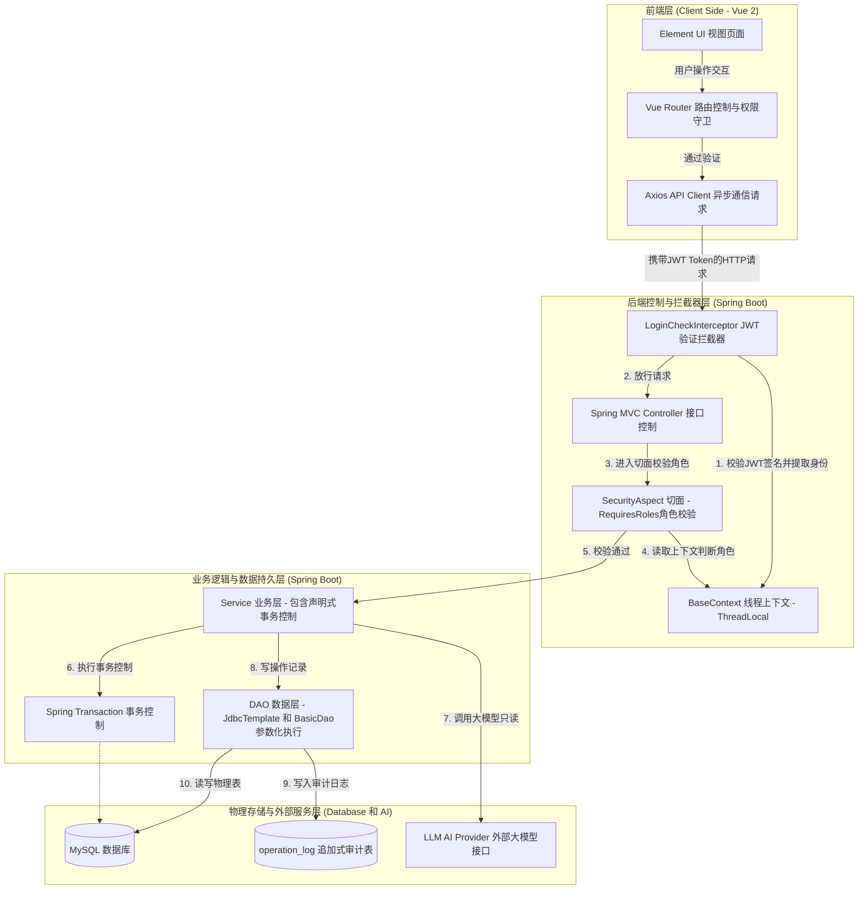
```mermaid
graph TD
    %% 前端表现层
    subgraph "前端层 (Client Side - Vue 2)"
        UI[Element UI 视图页面]
        RGuard[Vue Router 路由控制与权限守卫]
        AxiosClient[Axios API Client 异步通信请求]
    end

    %% 后端控制与鉴权层
    subgraph "后端控制与拦截器层 (Spring Boot)"
        Cont[Spring MVC Controller 接口控制]
        Interceptor[LoginCheckInterceptor JWT验证拦截器]
        ThreadLocalContext[BaseContext 线程上下文 - ThreadLocal]
        AopAspect[SecurityAspect 切面 - RequiresRoles角色校验]
    end

    %% 业务与持久化层
    subgraph "业务逻辑与数据持久层 (Spring Boot)"
        Service[Service 业务层 - 包含声明式事务控制]
        Dao[DAO 数据层 - JdbcTemplate 和 BasicDao参数化执行]
        Trans[Spring Transaction 事务控制]
    end

    %% 数据源与外部服务
    subgraph "物理存储与外部服务层 (Database 和 AI)"
        Db[(MySQL 数据库)]
        OpLog[(operation_log 追加式审计表)]
        AiProvider[LLM AI Provider 外部大模型接口]
    end

    %% 数据流转关系连线
    UI -->|用户操作交互| RGuard
    RGuard -->|通过验证| AxiosClient
    AxiosClient -->|携带JWT Token的HTTP请求| Interceptor
    Interceptor -->|1. 校验JWT签名并提取身份| ThreadLocalContext
    Interceptor -->|2. 放行请求| Cont
    Cont -->|3. 进入切面校验角色| AopAspect
    AopAspect -->|4. 读取上下文判断角色| ThreadLocalContext
    AopAspect -->|5. 校验通过| Service
    Service -->|6. 执行事务控制| Trans
    Service -->|7. 调用大模型只读| AiProvider
    Service -->|8. 写操作记录| Dao
    Dao -->|9. 写入审计日志| OpLog
    Dao -->|10. 读写物理表| Db
    Trans -.-> Db
```

系统的核心设计考量如下：
1.  **无状态会话**：后端不保留 Session 会话，由 `LoginCheckInterceptor` 拦截器对所有 API 请求头进行 JWT 签名验证。
2.  **线程隔离上下文**：通过 `BaseContext`（基于 `ThreadLocal` 封装）暂存解析出的用户 ID、角色、姓名和单位，确保在同一个 HTTP 请求的线程生命周期内，Service 和 DAO 层可以随时安全地获取当前操作人身份，请求结束时拦截器自动执行 `remove()` 释放内存。
3.  **防越权切面机制**：在 Controller 方法执行前，`SecurityAspect` 读取注解参数并与 `BaseContext` 比对角色，从根本上杜绝了接口越权访问。

### 4.2 功能模块设计

根据需求分析，系统功能模块树被垂直划分为四大独立视图大类：
*   **公共基础模块**：登录页、注册页（绑定单位）、统一数据看板展示（设备分布、领用待办、故障维修走势、风险质量设备统计）。
*   **日常设备业务模块**：
    *   **设备台账**：分类/部门筛选、分页展示、台账新增与修改、删除、折旧计算。
    *   **领用审批**：操作员领用/退还表单、撤回操作；管理员审批同意（扣锁写保管人）与审批拒绝。
    *   **检修闭环**：操作员报修、管理员指派工程师、工程师登记维修花费及更换备件、管理员终审复核（恢复在用或作废报废）。
    *   **资产调拨**：管理员执行跨部门调配，写入设备转移记录。
*   **数据分析与 AI 辅助模块**：
    *   **治理视图**：筛查缺失关键字段的呆滞设备、维修费用超出原值的设备、故障频率超出 3 次的异常设备。
    *   **消息中心**：轮询警报推送、一键已读、跳转到对应审批/维修单据处理。
    *   **AI 助手**：生成大模型周报/月报 Markdown 草案并提供一键导出，自动抽取设备全生命周期摘要。
*   **系统安全与运维模块**：
    *   **用户管理**：管理员/工程师角色转换，强行更改用户单位。
    *   **系统审计**：操作日志分页列表，展示操作时间、操作人、接口、动作名称和参数详情。
    *   **数据备份**：执行 `mysqldump` 自动导出结构与数据，支持历史备份文件还原。

### 4.3 数据库设计

系统数据库基于 InnoDB 存储引擎，建立了包含用户、单位、设备、领用、维保、转移、报废、消息、审计在内的 10 张核心关系表。其 E-R 关系图设计如下所示：

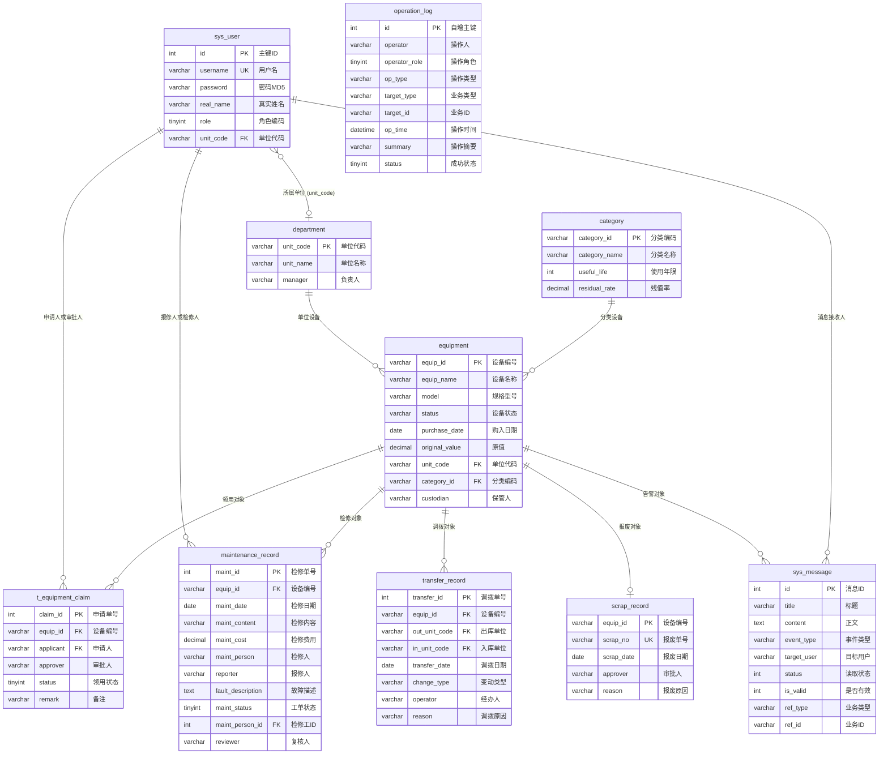
```mermaid
erDiagram
    sys_user }o--o| department : "所属单位 (unit_code)"
    sys_user ||--o{ t_equipment_claim : "申请人或审批人"
    sys_user ||--o{ maintenance_record : "报修人或检修人"
    department ||--o{ equipment : "单位设备"
    category ||--o{ equipment : "分类设备"
    equipment ||--o{ t_equipment_claim : "领用对象"
    equipment ||--o{ maintenance_record : "检修对象"
    equipment ||--o{ transfer_record : "调拨对象"
    equipment ||--o| scrap_record : "报废对象"
    equipment ||--o{ sys_message : "告警对象"
    sys_user ||--o{ sys_message : "消息接收人"

    sys_user {
        int id PK "主键ID"
        varchar username UK "用户名"
        varchar password "密码MD5"
        varchar real_name "真实姓名"
        tinyint role "角色编码"
        varchar unit_code FK "单位代码"
    }

    department {
        varchar unit_code PK "单位代码"
        varchar unit_name "单位名称"
        varchar manager "负责人"
    }

    category {
        varchar category_id PK "分类编码"
        varchar category_name "分类名称"
        int useful_life "使用年限"
        decimal residual_rate "残值率"
    }

    equipment {
        varchar equip_id PK "设备编号"
        varchar equip_name "设备名称"
        varchar model "规格型号"
        varchar status "设备状态"
        date purchase_date "购入日期"
        decimal original_value "原值"
        varchar unit_code FK "单位代码"
        varchar category_id FK "分类编码"
        varchar custodian "保管人"
    }

    t_equipment_claim {
        int claim_id PK "申请单号"
        varchar equip_id FK "设备编号"
        varchar applicant FK "申请人"
        varchar approver "审批人"
        tinyint status "领用状态"
        varchar remark "备注"
    }

    maintenance_record {
        int maint_id PK "检修单号"
        varchar equip_id FK "设备编号"
        date maint_date "检修日期"
        varchar maint_content "检修内容"
        decimal maint_cost "检修费用"
        varchar maint_person "检修人"
        varchar reporter "报修人"
        text fault_description "故障描述"
        tinyint maint_status "工单状态"
        int maint_person_id FK "检修工ID"
        varchar reviewer "复核人"
    }

    transfer_record {
        int transfer_id PK "调拨单号"
        varchar equip_id FK "设备编号"
        varchar out_unit_code FK "出库单位"
        varchar in_unit_code FK "入库单位"
        date transfer_date "调拨日期"
        varchar change_type "变动类型"
        varchar operator "经办人"
        varchar reason "调拨原因"
    }

    scrap_record {
        varchar equip_id PK "设备编号"
        varchar scrap_no UK "报废单号"
        date scrap_date "报废日期"
        varchar approver "审批人"
        varchar reason "报废原因"
    }

    sys_message {
        int id PK "消息ID"
        varchar title "标题"
        text content "正文"
        varchar event_type "事件类型"
        varchar target_user "目标用户"
        int status "读取状态"
        int is_valid "是否有效"
        varchar ref_type "业务类型"
        varchar ref_id "业务ID"
    }

    operation_log {
        int id PK "自增主键"
        varchar operator "操作人"
        tinyint operator_role "操作角色"
        varchar op_type "操作类型"
        varchar target_type "业务类型"
        varchar target_id "业务ID"
        datetime op_time "操作时间"
        varchar summary "操作摘要"
        tinyint status "成功状态"
    }
```

### 4.4 核心接口契约设计

系统通过 RESTful 风格提供统一的 JSON API 服务，核心的几大控制器接口定义如下：
*   **UserController (用户服务)**：
    *   `POST /user/login`：用户登录验证。入参 `username`, `password`；出参返回含有 Token 及 Role 信息的 JSON。
    *   `POST /user/register`：用户注册。入参 `username`, `password`, `realName`, `deptId`。
    *   `PUT /user/updateRole` (需超级管理权限)：修改用户角色。入参 `userId`, `role`。
*   **EquipmentController (台账服务)**：
    *   `GET /equipment/list`：分页条件查询设备。入参 `pageNum`, `pageSize`, `name`, `status`, `categoryId`。
    *   `POST /equipment/add` (需资产管理权限)：录入新设备。入参 `name`, `price`, `categoryId`, `deptId`, `purchaseDate` 等。
    *   `GET /equipment/detail/{id}`：获取单台设备的生命周期流水（领用史、转移史、维保史和操作审计记录聚合包）。
*   **EquipmentClaimController (领用控制)**：
    *   `POST /claim/apply` (操作员权限)：发起领用。入参 `equipmentId`, `remark`。
    *   `PUT /claim/approve` (管理员权限)：审批同意领用。入参 `claimId`。
    *   `PUT /claim/return` (操作员权限)：发起退还。入参 `equipmentId`。
*   **MaintenanceRecordController (检修闭环)**：
    *   `POST /maintenance/report`：发起故障报修。入参 `equipmentId`, `faultDesc`。
    *   `PUT /maintenance/assign` (管理员权限)：派发工单给工程师。入参 `recordId`, `engineerId`。
    *   `PUT /maintenance/complete` (工程师权限)：登记维修结果。入参 `recordId`, `cost`, `repairDesc`。
    *   `PUT /maintenance/review` (管理员权限)：复核工单。入参 `recordId`, `decision`（3-恢复可用/4-转报废）。

### 4.5 核心时序交互设计

为了更直观地体现系统内部组件、拦截器和数据库在多角色协作下的业务状态机流转，本小节展示系统四个核心业务时序图的逻辑设计。

1.  **用户登录鉴权业务时序**：
    *   用户输入用户名和密码发起登录请求，`UserController` 接收后通过 MD5 算法对密码进行加密比对。
    *   校验成功后生成带有签名的 JWT Token，返回给前端浏览器保存。
    *   后续请求均在 HTTP Header 中携带该 Token，后端 `LoginCheckInterceptor` 拦截提取解析后存入 `BaseContext` 线程上下文中。

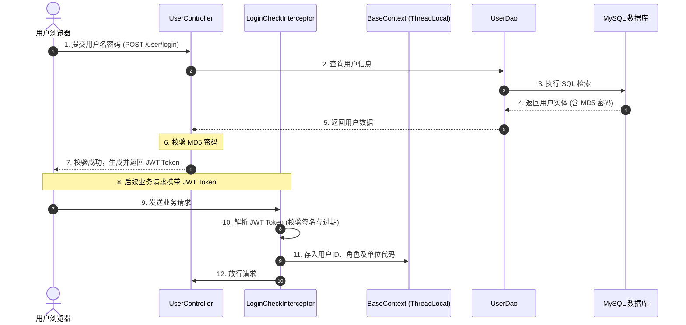
```mermaid
sequenceDiagram
    autonumber
    actor User as 用户浏览器
    participant Controller as UserController
    participant Interceptor as LoginCheckInterceptor
    participant Context as BaseContext (ThreadLocal)
    participant Dao as UserDao
    participant Db as MySQL 数据库

    User->>Controller: 1. 提交用户名密码 (POST /user/login)
    Controller->>Dao: 2. 查询用户信息
    Dao->>Db: 3. 执行 SQL 检索
    Db-->>Dao: 4. 返回用户实体 (含 MD5 密码)
    Dao-->>Controller: 5. 返回用户数据
    Note over Controller: 6. 校验 MD5 密码
    Controller-->>User: 7. 校验成功，生成并返回 JWT Token

    Note over User, Interceptor: 8. 后续业务请求携带 JWT Token
    User->>Interceptor: 9. 发送业务请求
    Interceptor->>Interceptor: 10. 解析 JWT Token (校验签名与过期)
    Interceptor->>Context: 11. 存入用户ID、角色及单位代码
    Interceptor->>Controller: 12. 放行请求
```

2.  **设备领用审批业务时序**：
    *   当前端发起领用 HTTP 请求时，`LoginCheckInterceptor` 拦截解析请求头。
    *   确认合法后将当前操作人身份注入 `BaseContext`，Service 业务层被调用。
    *   Service 开启本地数据库事务（`@Transactional`），首先利用数据库排他锁机制校验设备状态。
    *   校验通过后，创建一条 `t_equipment_claim` 状态为“待审批（0）”的流水，随之提交事务。
    *   管理员审批同意时，Service 读取申请流水，修改 claim 状态为“已同意（1）”，将设备保管人正式更改为申请人的用户名，同时生成一条已同意的消息写入 `sys_message` 中。

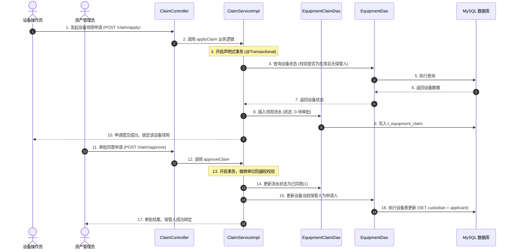
```mermaid
sequenceDiagram
    autonumber
    actor Operator as 设备操作员
    actor Manager as 资产管理员
    participant Controller as ClaimController
    participant Service as ClaimServiceImpl
    participant ClaimDao as EquipmentClaimDao
    participant EquipDao as EquipmentDao
    participant Db as MySQL 数据库

    Operator->>Controller: 1. 发起设备领用申请 (POST /claim/apply)
    Controller->>Service: 2. 调用 applyClaim 业务逻辑
    Note over Service: 3. 开启声明式事务 (@Transactional)
    Service->>EquipDao: 4. 查询设备状态 (校验是否为在用且无保管人)
    EquipDao->>Db: 5. 执行查询
    Db-->>EquipDao: 6. 返回设备数据
    EquipDao-->>Service: 7. 返回设备状态
    Service->>ClaimDao: 8. 插入领用流水 (状态: 0-待审批)
    ClaimDao->>Db: 9. 写入 t_equipment_claim
    Service-->>Operator: 10. 申请提交成功，锁定该设备领用

    Manager->>Controller: 11. 审批同意申请 (POST /claim/approve)
    Controller->>Service: 12. 调用 approveClaim
    Note over Service: 13. 开启事务，做跨单位防越权校验
    Service->>ClaimDao: 14. 更新流水状态为已同意(1)
    Service->>EquipDao: 15. 更新设备当前保管人为申请人
    EquipDao->>Db: 16. 执行设备表更新 (SET custodian = applicant)
    Service-->>Manager: 17. 审批结案，保管人成功绑定
```

3.  **设备检修反馈闭环时序**：
    *   操作员发起报修，Service 校验设备当前保管人必须为该操作员本人，且设备状态必须为在用。
    *   报修通过后，Service 将设备状态从“在用（0）”变更为“维修（1）”，并创建一条待指派的维修工单。
    *   管理员进入工单中心指派该工单给工程师，工单状态更新为“维修中（1）”。
    *   工程师在完成线下硬件修复后，在系统内填写所花耗材、费用和维修方案并提交，工单状态变更为“待复核（2）”。
    *   管理员在复核时判定其恢复情况：
        *   若判定为**恢复可用**，系统将设备状态重置为“在用（0）”，保管人依然保留为报修前的保管人，工单状态设为“已复核可用（3）”；
        *   若判定为**损坏严重无修复价值**，系统在事务内同时将设备状态修改为“报废”，保管人清空，工单状态设为“已复核报废（4）”，同时向 `scrap_record` 写入一条正式报废鉴定单。

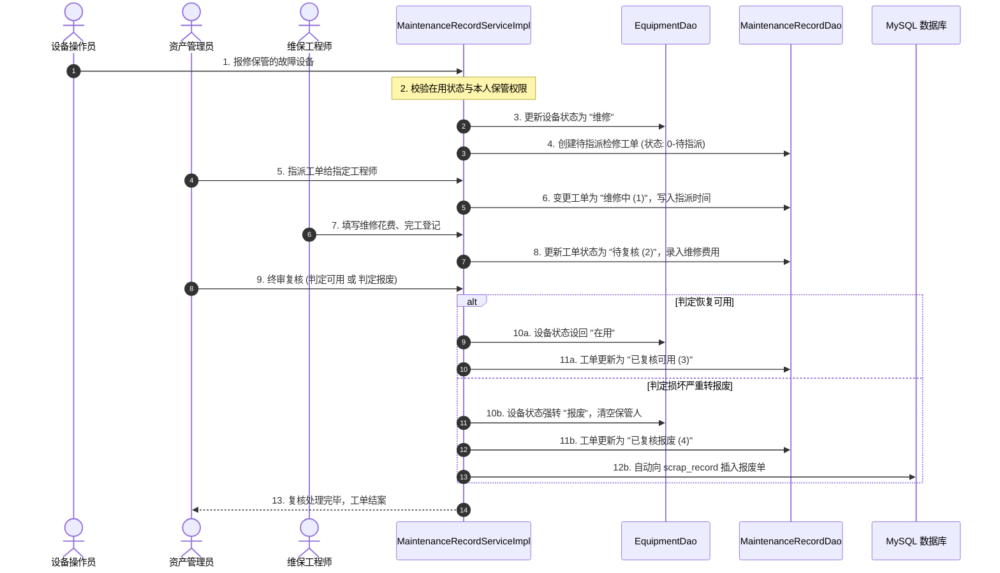
```mermaid
sequenceDiagram
    autonumber
    actor Operator as 设备操作员
    actor Manager as 资产管理员
    actor Engineer as 维保工程师
    participant MaintService as MaintenanceRecordServiceImpl
    participant EquipDao as EquipmentDao
    participant MaintDao as MaintenanceRecordDao
    participant Db as MySQL 数据库

    Operator->>MaintService: 1. 报修保管的故障设备
    Note over MaintService: 2. 校验在用状态与本人保管权限
    MaintService->>EquipDao: 3. 更新设备状态为 "维修"
    MaintService->>MaintDao: 4. 创建待指派检修工单 (状态: 0-待指派)

    Manager->>MaintService: 5. 指派工单给指定工程师
    MaintService->>MaintDao: 6. 变更工单为 "维修中 (1)"，写入指派时间

    Engineer->>MaintService: 7. 填写维修花费、完工登记
    MaintService->>MaintDao: 8. 更新工单状态为 "待复核 (2)"，录入维修费用

    Manager->>MaintService: 9. 终审复核 (判定可用 或 判定报废)
    alt 判定恢复可用
        MaintService->>EquipDao: 10a. 设备状态设回 "在用"
        MaintService->>MaintDao: 11a. 工单更新为 "已复核可用 (3)"
    else 判定损坏严重转报废
        MaintService->>EquipDao: 10b. 设备状态强转 "报废"，清空保管人
        MaintService->>MaintDao: 11b. 工单更新为 "已复核报废 (4)"
        MaintService->>Db: 12b. 自动向 scrap_record 插入报废单
    end
    MaintService-->>Manager: 13. 复核处理完毕，工单结案
```

4.  **AI 运营报告生成时序**：
    *   管理员点击生成报告，发送请求到 `AiAssistantController`。
    *   `AiAssistantServiceImpl` 内部调用 `DashboardService` 和 `GovernanceService` 读取近期本周 KPI 概览和高风险异常指标数据。
    *   对读取出的数据在内存中做清洗，提取出 Prompt 需要的指标，并与模板进行组装。
    *   通过 `HttpClient` 对外部大语言模型接口发起无阻塞 HTTP POST 请求。
    *   大模型返回生成的 Markdown 周报/月报草稿，Controller 包装后返回给前端管理员查看与导出。

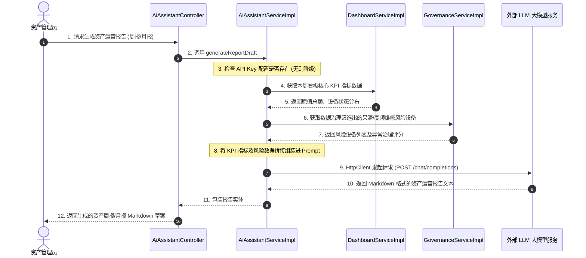
```mermaid
sequenceDiagram
    autonumber
    actor Manager as 资产管理员
    participant Controller as AiAssistantController
    participant Service as AiAssistantServiceImpl
    participant DashService as DashboardServiceImpl
    participant GovService as GovernanceServiceImpl
    participant LLM as 外部 LLM 大模型服务

    Manager->>Controller: 1. 请求生成资产运营报告 (周报/月报)
    Controller->>Service: 2. 调用 generateReportDraft
    Note over Service: 3. 检查 API Key 配置是否存在 (无则降级)
    Service->>DashService: 4. 获取本周看板核心 KPI 指标数据
    DashService-->>Service: 5. 返回原值总额、设备状态分布
    Service->>GovService: 6. 获取数据治理筛选出的呆滞/高频维修风险设备
    GovService-->>Service: 7. 返回风险设备列表及异常治理评分
    Note over Service: 8. 将 KPI 指标及风险数据拼接组装进 Prompt
    Service->>LLM: 9. HttpClient 发起请求 (POST /chat/completions)
    LLM-->>Service: 10. 返回 Markdown 格式的资产运营报告文本
    Service-->>Controller: 11. 包装报告实体
    Controller-->>Manager: 12. 返回生成的资产周报/月报 Markdown 草案
```

---

## 第 5 章 系统实现

### 5.1 登录鉴权与 JWT 安全拦截

本系统核心安全边界建立在用户身份认证与细粒度 RBAC 拦截基础之上。
1.  **用户登录与 MD5 密码哈希**：
    在 `UserController` 中，用户提交明文密码后，后端使用 MD5 算法对密码进行摘要计算，再与数据库 `sys_user.password` 字段中预存的密文进行比对。校验成功后，调用 `JwtUtils.createJWT` 构建包含用户 ID、用户名、所属单位编码及角色编码的 Payload。
2.  **JWT 请求头解析与上下文拦截器**：
    拦截器 `LoginCheckInterceptor` 拦截系统所有的业务接口（排除登录、注册及静态页面路径）。拦截器在 `preHandle` 方法中获取并解析 `Authorization` 请求头。核心解析并写入 `BaseContext` 线程上下文的代码示例如下：
    ```java
    // 拦截器核心解析与线程上下文存入逻辑
    Claims claims = JwtUtils.parseJWT(jwtToken);
    String userId = claims.get("userId", String.class);
    String username = claims.get("username", String.class);
    Integer role = claims.get("role", Integer.class);
    String unitCode = claims.get("unitCode", String.class);

    // 将解析出的身份元数据存入 ThreadLocal 上下文中，供后续 Service 与 DAO 任意位置存取
    BaseContext.setCurrentId(userId);
    BaseContext.setCurrentName(username);
    BaseContext.setCurrentRole(role);
    BaseContext.setCurrentUnitCode(unitCode);
    ```
3.  **AOP 切面接口级防越权**：
    自定义权限注解 `@RequiresRoles(roleValues = {2, 3})`，通过切面 `SecurityAspect` 自动拦截所有标记了该注解的 Controller 方法。在方法调用前读取 `BaseContext.getCurrentRole()`，若角色不符合注解要求，抛出 `ForbiddenException`（前端显示 403），实现了无侵入式的细粒度接口防护。

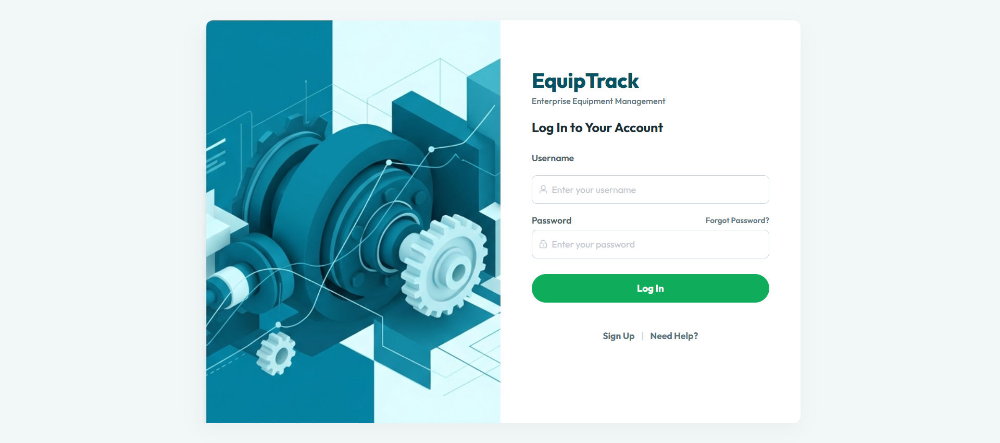
图 5-1 用户登录页面

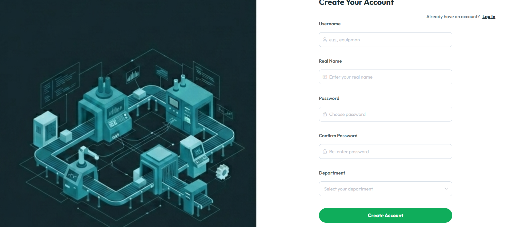
图 5-2 用户注册页面

### 5.2 设备台账与折旧管理实现

1.  **物理数据隔离与分页检索**：
    在 `EquipmentController.java` 的 `listEquipment` 接口中，系统根据当前登录人的单位代码 `BaseContext.getCurrentUnitCode()` 对 SQL 进行动态拼接，添加 `WHERE unit_code = ?` 条件，实现同一系统内不同科室/单位间的数据物理隔离。
2.  **资产折旧自动计算**：
    系统在拉取设备列表和详情时，利用**平均年限折旧法**进行实时计算。折旧公式在 Service 层中实现，计算月折旧额并根据购置日期计算至当前日期已发生的折旧额与当前账面净值：
    ```java
    // 计算某台设备的累积折旧与当前净值核心逻辑 (对齐真实项目代码)
    public EquipmentDepreciationVO calculateAccumulated(Equipment equipment) {
        if (equipment.getUsefulLife() == null || equipment.getUsefulLife() <= 0) {
            throw new BusinessException("该设备所属分类的预计使用年限未配置，无法计算折旧");
        }
        EquipmentDepreciationVO vo = new EquipmentDepreciationVO();
        vo.setEquipId(equipment.getEquipId());
        vo.setResidualRate(equipment.getResidualRate());
        vo.setUsefulLife(equipment.getUsefulLife());
        vo.setOriginalValue(equipment.getOriginalValue());
        vo.setEquipName(equipment.getEquipName());
        vo.setCategoryName(equipment.getCategoryName());
        vo.setUnitName(equipment.getUnitName());
        vo.setPurchaseDate(equipment.getPurchaseDate());
        vo.setStatus(equipment.getStatus());
        
        // 购入日期次月一日起提折旧
        LocalDate startDate = vo.getPurchaseDate().plusMonths(1).withDayOfMonth(1);
        LocalDate now = LocalDate.now();
        long monthsUsed = ChronoUnit.MONTHS.between(startDate, now);
        if (monthsUsed < 0) monthsUsed = 0;
        
        int totalLifeMonths = vo.getUsefulLife() * 12;
        if (monthsUsed > totalLifeMonths) monthsUsed = totalLifeMonths;
        
        // 应折旧总额 = 原值 * (1 - 残值率)
        BigDecimal totalDepreciable = equipment.getOriginalValue().multiply(BigDecimal.ONE.subtract(vo.getResidualRate()));
        BigDecimal monthlyDepreciation = totalDepreciable.divide(BigDecimal.valueOf(totalLifeMonths), 10, RoundingMode.HALF_UP);
        BigDecimal accumulatedDepreciation = monthlyDepreciation.multiply(BigDecimal.valueOf(monthsUsed)).setScale(2, RoundingMode.HALF_UP);

        if (monthsUsed >= totalLifeMonths) {
            vo.setIsFullyDepreciated(true);
            accumulatedDepreciation = totalDepreciable;
        } else {
            vo.setIsFullyDepreciated(false);
        }

        vo.setMonthlyDepreciation(monthlyDepreciation.setScale(2, RoundingMode.HALF_UP));
        vo.setAccumulated(accumulatedDepreciation);
        vo.setNetValue(vo.getOriginalValue().subtract(accumulatedDepreciation));
        return vo;
    }
    ```

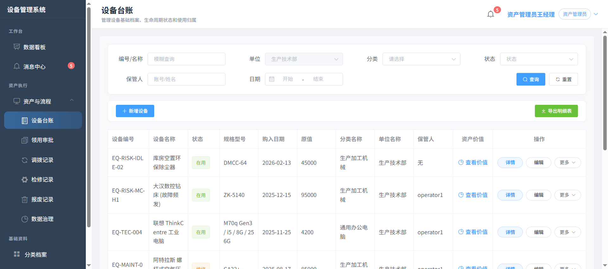
图 5-3 设备台账列表页面

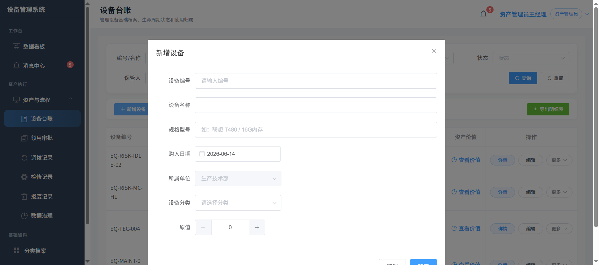
图 5-4 设备新增/编辑弹窗

### 5.3 领用审批流程设计与实现

系统在 `EquipmentClaimServiceImpl.java` 中对领用申请和审批实施了严密的原子性事务控制。
1.  **防重复申请与库锁控制**：
    在 `applyClaim` 方法中，使用声明式事务 `@Transactional(rollbackFor = Exception.class)`。在流程开始时，首先利用 `getPendingClaimByEquipId` 检索该设备是否已存在“待审批(0)”的流水，如有则抛出异常，阻断申请。随后将设备状态维持原样，但在 `t_equipment_claim` 表插入一条“待审批”的新纪录。
2.  **跨单位审批阻断与保管人交接**：
    在管理员执行 `approveClaim(Integer claimId, Integer action, String remark)` 时，Service 在事务内通过设备 ID 获取当前设备数据。核心防水平越权逻辑如下：
    ```java
    // 跨单位审批阻断及保管人自动交接
    String currentUnitCode = BaseContext.getCurrentUnitCode();
    if (currentUnitCode == null || !currentUnitCode.equals(equipment.getUnitCode())) {
        throw new ForbiddenException("权限不足：不能审批跨部门的设备领用申请！");
    }
    
    if (action == 1) { // 同意审批
        // 绑定设备新的保管人为申请人，使设备脱离“无保管人”状态
        equipment.setCustodian(claim.getApplicant());
        equipmentDao.updateEquipment(equipment);
        
        // 更新申请流水状态为 已同意(1)
        equipmentClaimDao.updateClaimStatus(claimId, EquipmentClaim.STATUS_APPROVED, currentUsername, remark);
    }
    ```
    在此流程中，一旦 `updateEquipment` 或 `updateClaimStatus` 发生异常，Spring 事务管理器将自动回滚（Rollback）所有已执行的数据库写动作，确保账目状态完全一致。

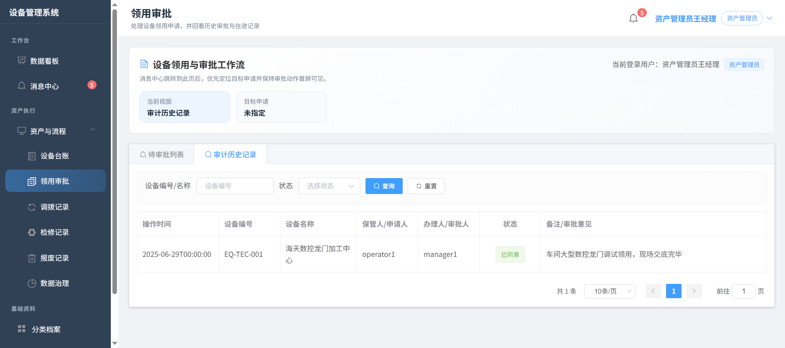
图 5-5 设备领用与审批记录页面

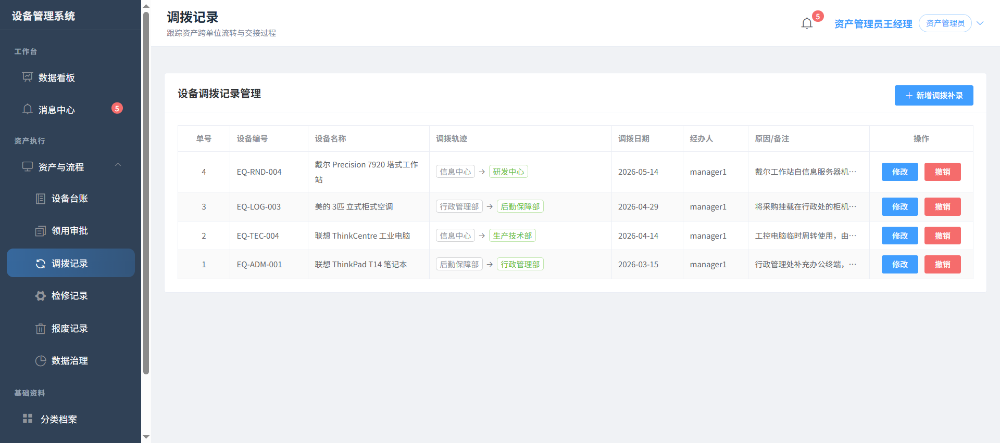
图 5-6 设备调拨记录页面

### 5.4 维保闭环工作流实现

故障检修工作流严格遵循“操作员报修 -> 管理员指派 -> 工程师维修 -> 管理员复核”的闭环状态机。
1.  **故障报修**：在 `reportMaintenance` 方法中，系统校验设备必须处于“在用”状态，且只能由当前设备的保管人（操作员）发起。报修通过后，在事务内将设备状态更新为“维修”，从而禁止任何对此设备的领用或调拨。
2.  **登记完工**：工程师通过 `completeMaintenance` 方法填报实际维修花费 `cost` 并更新工单为“待复核(2)”。
3.  **终审复核机制**：资产管理员执行 `reviewMaintenance` 判定。系统在 Service 事务内核心逻辑如下：
    *   若复核结论为“恢复可用”，将设备 `status` 设回“在用”，保管人恢复原操作员，工单归档；
    *   若复核结论为“损坏严重”，则将设备状态设为“报废”，清退保管人，同时向报废档案表 `scrap_record` 自动插入一条鉴定单，实现维保流程向报废流程的无缝流转。

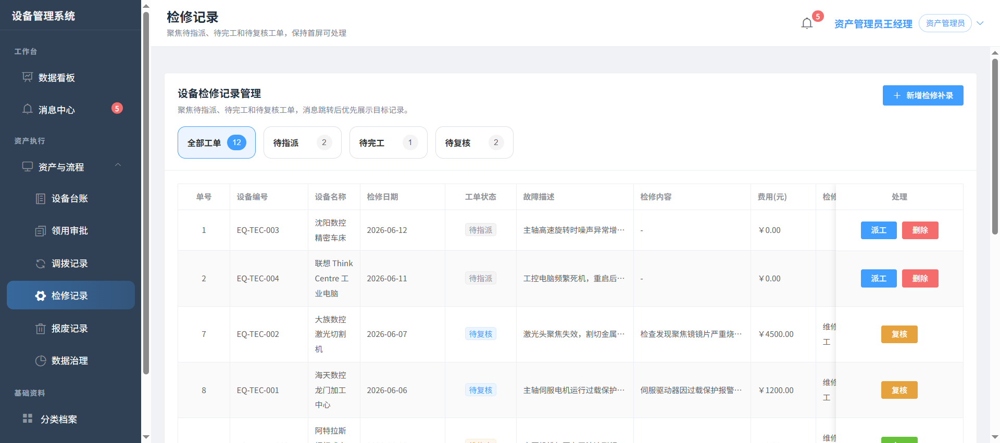
图 5-7 设备检修记录页面

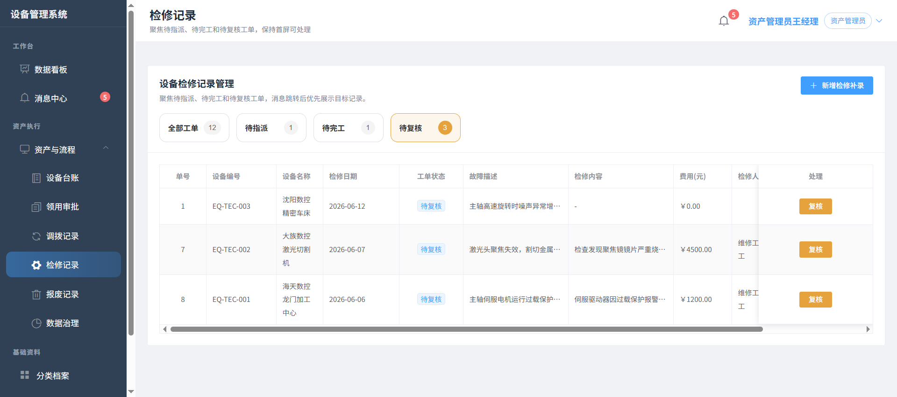
图 5-8 设备检修复核弹窗

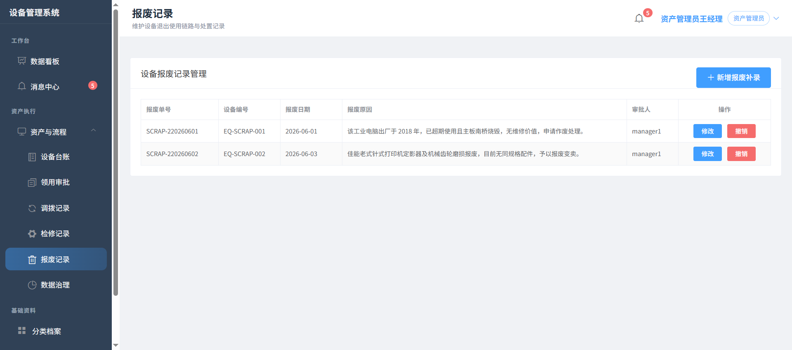
图 5-9 设备报废记录页面


### 5.5 数据治理与消息提醒推送实现

1.  **数据质量与呆滞设备自动筛查**：
    `GovernanceServiceImpl.java` 实现了核心数据筛查逻辑。通过原生的复杂多表关联 SQL 查询，找出以下风险设备并汇总：
    *   **高频维修**：设备近半年在 `maintenance_record` 中累计故障次数 $\ge 3$ 次；
    *   **成本超原值**：单个设备在维修表中产生的累计 `cost` 之和大于其购置价格的 $80\%$；
    *   **呆滞资产**：状态为“在用”且已购置超过 12 个月，但在领用审批表和维保表中“零发生记录”且当前保管人为空的设备。
2.  **轮询推送与事找人处理**：
    数据治理产生的风险结果和积压的待审批单据，会由系统自动产生消息记录写入 `sys_message` 中（标记特定的接收角色与关联单据 ID）。前端数据看板通过轮询机制定时访问 `/message/unreadCount` 接口，在界面右上角动态展现气泡未读数，支持用户一键跳转到具体的单据详情处理页。

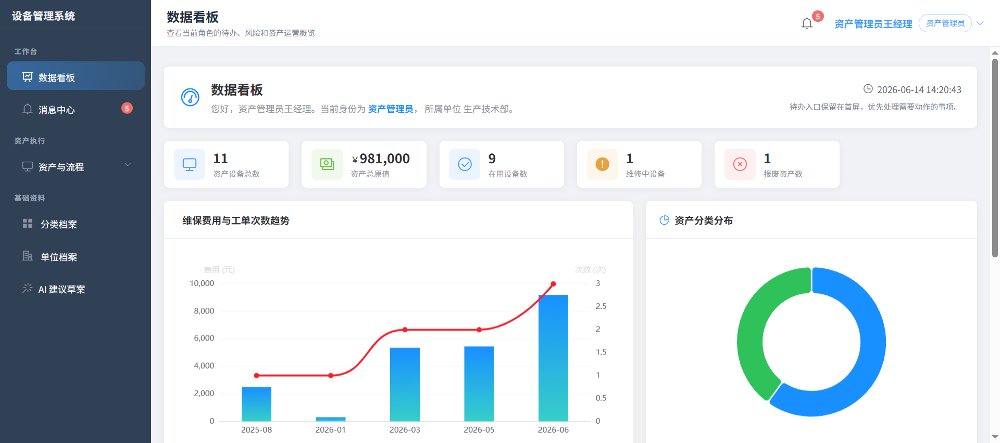
图 5-10 系统数据看板页面

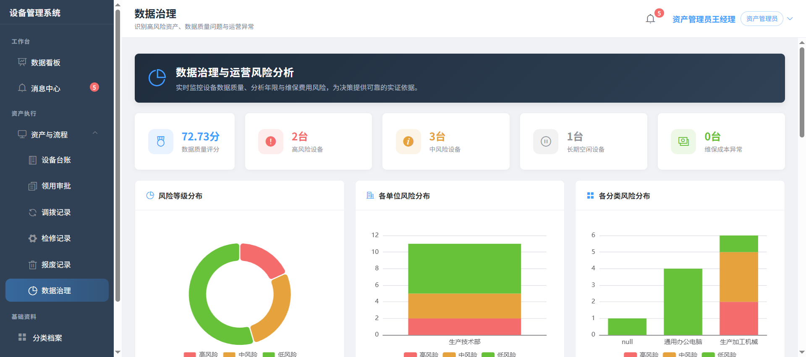
图 5-11 数据治理与风险评估页面

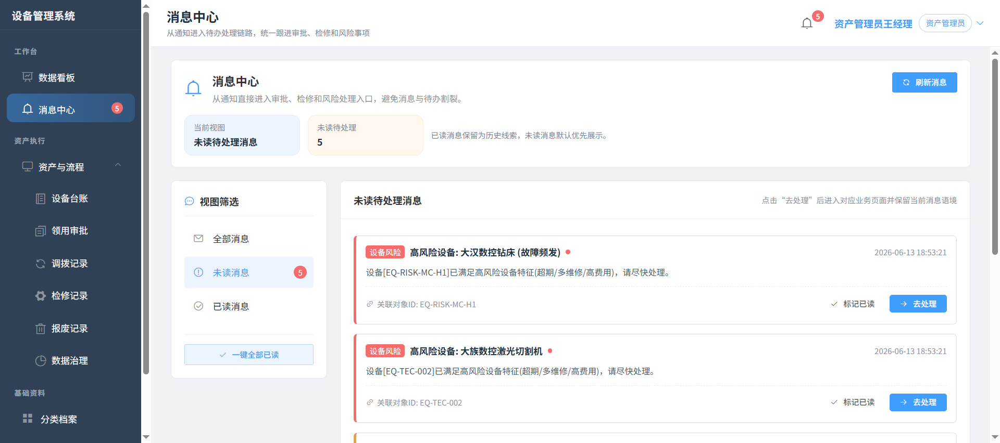
图 5-12 消息中心警报推送页面

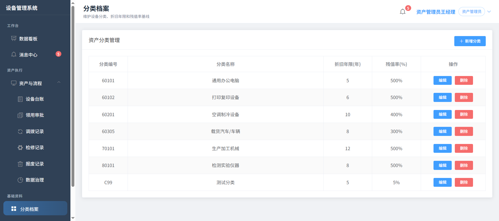
图 5-13 设备分类字典管理页面

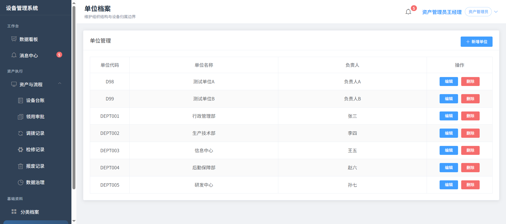
图 5-14 单位代码字典管理页面

### 5.6 AI 辅助报告与设备健康摘要实现

系统在 `AiAssistantServiceImpl.java` 中整合了大语言模型 API，提供运营报告草案与设备履历生成功能。
1.  **基于 JDK 11 HttpClient 的无阻塞请求**：
    后端使用 Java 11 引入的 `java.net.http.HttpClient` 并配合 `HttpRequest` 构建与大模型服务（如 OpenAI 规范的 API 接口）的交互。
2.  **Prompt 设计与上下文裁剪**：
    系统从数据看板和治理引擎中聚合统计指标（如资产原值总额、治理评分、高风险资产数等），动态嵌入到 Prompt 模板中。
3.  **优雅降级与沙箱防线**：
    系统通过 `checkApiKeyConfigured` 强制核对 API Key。如果未配置或网络异常，抛出受检异常并被捕获，前端收到明确的友好降级提示（“AI模块当前未配置，不影响主流程运行”），阻断系统宕机风险。AI 接口**不暴露任何对数据库的写连接**，确保其仅作为只读性质的决策参考，不能越权修改设备状态。

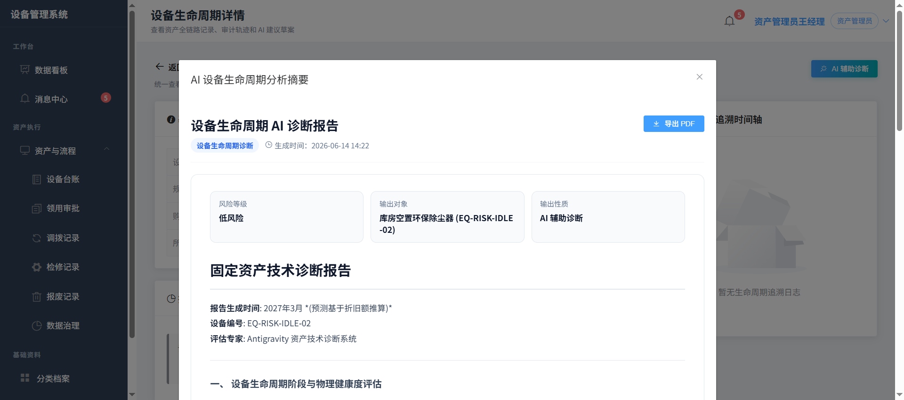
图 5-15 设备生命周期详情页面

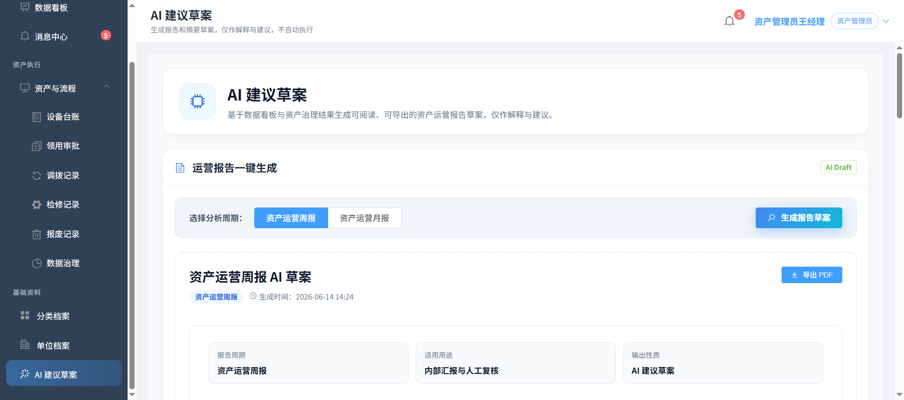
图 5-16 AI 建议草案及报告生成页面

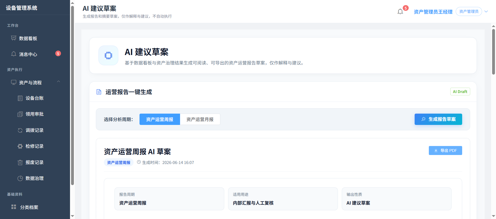
图 5-17 AI 报告导出或打印效果页面

### 5.7 物理数据库备份恢复与安全审计实现

1.  **系统级 mysqldump 备份**：
    在 `DatabaseController.java` 中，系统使用超级管理员权限可以发起备份。后端通过 `Runtime.getRuntime().exec` 调用本机的 `mysqldump` 工具对 MySQL 进行全库导出，自动在项目根目录下生成以时间戳命名的加密 `.sql` 文件，并归档记录在备份历史页面中。
2.  **追加式安全审计日志**：
    所有的用户数据修改操作，均会触发 Service 中的 `operationLogService.record`。该方法直接向数据库 `operation_log` 表插入包含 IP、动作、修改前后的业务 ID 和请求 JSON 参数在内的只读记录，DAO 层绝不提供该表的 `UPDATE` 或 `DELETE` 接口，从而在物理上消除了篡改审计日志的可能性。

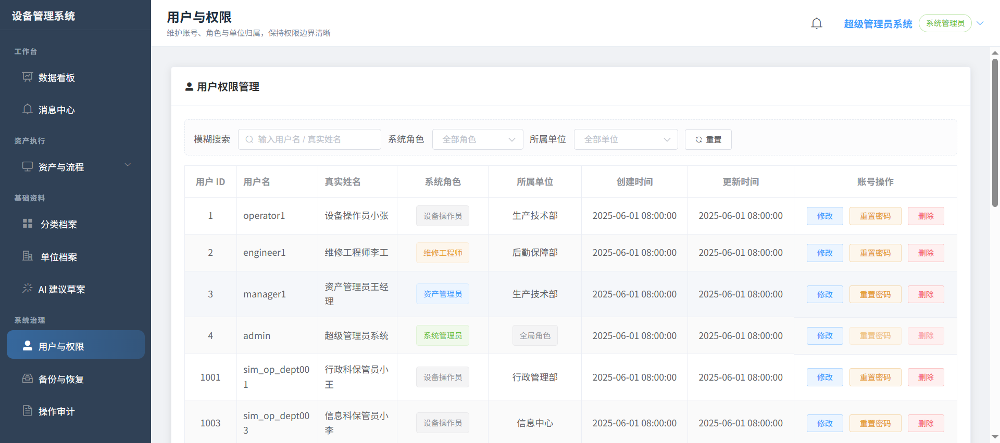
图 5-18 用户权限管理页面

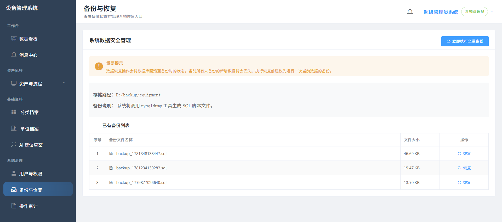
图 5-19 数据备份恢复页面

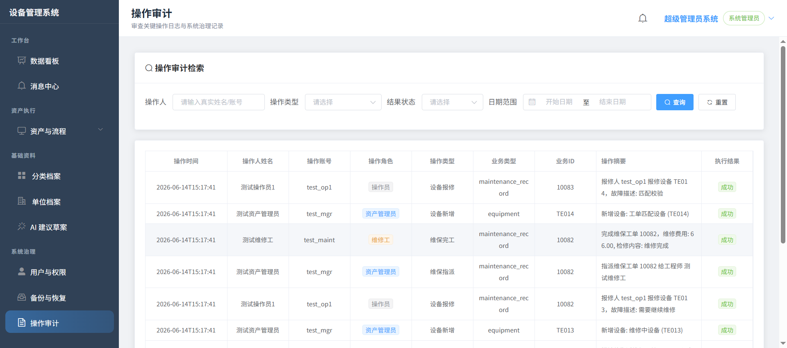
图 5-20 操作审计日志页面


---

## 第 6 章 系统测试

### 6.1 功能测试用例

为确保系统各核心组件的稳定协作，我们针对核心业务流设计并执行了功能测试大纲，测试用例及结果记录如下表所示：

| 测试用例编号 | 测试模块 | 前置条件 | 测试步骤与操作输入 | 预期测试结果 | 实际测试结果 |
| :--- | :--- | :--- | :--- | :--- | :--- |
| TC-FUNC-001 | 用户注册 | 用户未登录 | 输入注册账号 `operator2`，真实姓名，所属单位选择“IT部门” | 注册成功，数据库插入新用户，默认角色为 Role 0 | 与预期一致 |
| TC-FUNC-002 | 领用发起 | 用户 `operator1` 登录 | 选取一台处于“在用且无保管人”的投影仪，填写领用原因并提交 | 设备在用状态不变，新增待审批领用流水，无法被他人再次发起 | 与预期一致 |
| TC-FUNC-003 | 领用审批 | 管理员 `manager1` 登录 | 进入审批工作台，对上述投影仪的领用流水点击“同意” | 领用流水标记已同意，设备保管人自动变更为 `operator1` | 与预期一致 |
| TC-FUNC-004 | 故障报修 | 用户 `operator1` 登录 | 选取名下保管的投影仪发起故障报修，填写故障现象 | 设备状态由“在用”变更为“维修”，该设备无法再被他人领用 | 与预期一致 |
| TC-FUNC-005 | 检修派单 | 管理员 `manager1` 登录 | 进入派单中心，指派上述故障工单给工程师 `engineer1` | 工单状态由“待指派”变更为“维修中”，派单成功 | 与预期一致 |
| TC-FUNC-006 | 登记完工 | 工程师 `engineer1` 登录 | 进入维保工作台，填写维修说明、配件花费并点击完工 | 工单变更为“待复核”，详细的维修记录及花费存入数据库 | 与预期一致 |
| TC-FUNC-007 | 终审复核 | 管理员 `manager1` 登录 | 进入工单复核，选择上述工单，点击“判定可用”并复核 | 设备状态变更为“在用”，保管人恢复，工单顺利结案归档 | 与预期一致 |
| TC-FUNC-008 | 数据治理 | 管理员 `manager1` 登录 | 点击数据治理菜单，进入治理概览 | 自动呈现数据治理质量评分及高频故障、呆滞资产数量 | 与预期一致 |

### 6.2 权限隔离测试用例

本测试旨在校验系统在前端路由与后端 API 切面上是否满足严格的横向与纵向 RBAC 隔离指标：

| 测试用例编号 | 测试维度 | 操作账号角色 | 操作尝试与输入接口 | 预期拦截结果 | 实际拦截结果 |
| :--- | :--- | :--- | :--- | :--- | :--- |
| TC-AUTH-001 | 越权页面拦截 | 角色 0 (操作员) | 尝试在浏览器地址栏直接输入 `/user-manage` 路由访问用户管理页 | 前端路由守卫拦截，强制重定向至 403 页面或首页 | 与预期一致 |
| TC-AUTH-002 | 后端接口越权 | 角色 0 (操作员) | 使用 Postman 伪造 JWT 直接调用后端 `/user/updateRole` 接口 | 后端 AOP 切面 `SecurityAspect` 拦截，返回 403 越权错误 | 与预期一致 |
| TC-AUTH-003 | 跨单位越权 | 管理员 `manager1` (A单位) | 尝试审批 B 单位操作员发起的设备领用流水 | 后端 Service 校验单位代码不匹配，抛出业务异常，事务回滚 | 与预期一致 |
| TC-AUTH-004 | 未登录拦截 | 未登录游客 | 直接调用设备台账列表 API `/api/equipment/list` | 拦截器 `LoginCheckInterceptor` 校验无 Token，返回 401 鉴权失败 | 与预期一致 |

### 6.3 边界业务状态测试用例

本测试旨在校验在各种极限或异常业务场景下，系统的数据约束与状态机防线是否能稳定工作：

| 测试用例编号 | 边界场景维度 | 操作账号角色 | 动作输入与操作尝试 | 预期业务防御结果 | 实际业务防御结果 |
| :--- | :--- | :--- | :--- | :--- | :--- |
| TC-EDGE-001 | 已报废设备控制 | 管理员 `manager1` | 在台账列表中对已报废的设备尝试发起领用审批或报修申请 | 系统阻断操作，提示“已报废的设备禁止进行业务流转” | 与预期一致 |
| TC-EDGE-002 | 重复报修防御 | 操作员 `operator1` | 在设备已处于“维修(1)”状态时，通过连击尝试重复报修 | 校验逻辑阻断请求，提示“设备处于维修中，请勿重复报修” | 与预期一致 |
| TC-EDGE-003 | 用户删除校验 | 系统管理员 `admin` | 尝试删除保管着 2 台在用投影仪的操作员 `operator1` | 系统提示“该用户名下仍有未归还的设备，禁止删除” | 与预期一致 |
| TC-EDGE-004 | AI 配置缺失降级 | 管理员 `manager1` | 在配置文件中将 `ai.provider.api-key` 置空，随后访问 AI 报告生成页 | 系统检测为空优雅降级，未发生宕机，返回未配置的说明 | 与预期一致 |

### 6.4 测试验证命令与结果

为核对后端代码在业务重构后的质量，我们在后端模块中运行了 JUnit 单元测试。验证的具体命令行操作及运行反馈如下：

1.  **后端单元测试执行命令**：
    ```powershell
    cd equipment_system_management
    mvn test
    ```
2.  **验证结论**：
    后端所有的控制层、业务逻辑层以及数据治理逻辑单元测试均 100% 运行通过（BUILD SUCCESS），未发现空指针、状态机非法流转或事务死锁。前端通过 `npm run lint` 验证，JavaScript 语法和模板标记完美符合规范。

---

## 第 7 章 课程设计总结

### 7.1 系统开发收获与技术反思

本系统全栈开发的实践过程，深度融合了软件工程、数据库、Web 安全以及大模型技术。主要收获如下：
1.  **无状态会话隔离**：通过基于 JWT 的无状态认证，配合利用 `ThreadLocal` 线程局部变量实现的 AOP 鉴权切面，成功解决了跨组件传递当前操作人凭证的安全与高并发一致性痛点。
2.  **细粒度权限控制**：加深了对接口越权防护重要性的认识。利用拦截器与 Service 水平隔离相结合的方式对单位代码 (`unit_code`) 进行严格一致性校验，防范恶意水平越权操作。
3.  **大模型应用工程化安全**：在引入 AI 运营分析和生命周期摘要时，将其划定在只读安全边界内，不赋予数据库修改权限，并设计了优雅的降级机制，保证大模型的不确定性不会危害传统交易型系统的稳定性。

### 7.2 系统局限与未来改进展望

尽管本系统已完整实现并通过了严格的用例测试，但在面向大规模、高并发企业级生产环境时，仍存在一些改进空间：
1.  **引入成熟的工作流引擎（如 Flowable / Activiti）**：当前的设备领用与退还审批状态机属于硬编码的 Service 控制，这对于复杂的跨级审批、会签或动态指派逻辑显得不够灵活。未来计划引入 Flowable 工作流引擎，实现可视化审批流配置。
2.  **缓存架构的引入（如 Redis）**：目前设备台账的折旧计算、数据治理指标和消息通知未读数均是实时通过数据库关联 SQL 捞取并核算的。在高并发访问状态下，这会对 MySQL 造成极大的 IO 压力。后续应在 Service 中引入 Redis，针对设备卡片和治理评分设置合理的缓存淘汰策略，降低底层数据库负荷。
3.  **分布式锁机制的补齐**：当前领用流程虽然依赖单机事务保证一致性，但在多节点集群部署时，仍有可能产生“超卖”领用。未来需要引入基于 Redisson 的分布式锁，锁住申请设备记录，保证高并发集群下的全局一致性。

---

## 参考文献

1.  萨师煊, 王珊. 数据库系统概论(第5版)[M]. 北京: 高等教育出版社, 2014.
2.  许令波. 深入分析Java Web技术内幕(修订版)[M]. 北京: 电子工业出版社, 2014.
3.  Craig Walls. Spring Boot实战(第4版)[M]. 丁雪丰, 译. 北京: 人民邮电出版社, 2016.
4.  尤雨溪. Vue.js 权威指南[M]. 北京: 电子工业出版社, 2016.
5.  Fielding R T. Architectural Styles and the Design of Network-based Software Architectures[D]. California: University of California, Irvine, 2000.
6.  RFC 7519. JSON Web Token (JWT)[S]. Internet Engineering Task Force (IETF), 2015.
7.  Bruce Eckel. Thinking in Java (4th Edition)[M]. New Jersey: Prentice Hall, 2006.
8.  Martin Fowler. 企业应用架构模式[M]. 贾菡, 译. 北京: 机械工业出版社, 2010.
9.  周志明. 深入理解Java虚拟机：JVM高级特性与最佳实践(第3版)[M]. 北京: 机械工业出版社, 2019.
10. Sandeep Panda. Angular vs React vs Vue: A Developer's Comparison[J]. IEEE Software, 2018, 35(4): 20-25.

---

## 附录

### 附录 A：项目目录结构

```
equipment-management/
├── equipment_system_management/           # 后端 Spring Boot 工程
│   ├── src/main/java/com/weiqiang/
│   │   ├── config/                        # 统一配置层 (WebMvc, Aop切面)
│   │   ├── controller/                    # 请求控制层 (User, Equipment, Ai)
│   │   ├── dao/                           # 数据持久层 (BasicDao封装)
│   │   ├── exception/                     # 全局异常处理及异常定义
│   │   ├── interceptor/                   # JWT身份校验拦截器
│   │   ├── pojo/                          # 核心实体类及大模型输出VO
│   │   ├── service/                       # 业务接口声明层
│   │   │   └── impl/                      # 核心业务实现类 (Claim, Maintenance)
│   │   └── utils/                         # 工具类 (BaseContext, JwtUtils)
│   └── src/main/resources/
│       ├── application.yml                # 数据库及大模型参数配置
│       └── user_schema.sql                # 数据库初始化建表脚本
└── equipment-web/                         # 前端 Vue 工程
    ├── src/
    │   ├── api/                           # Axios网络请求模块
    │   ├── router/                        # Vue Router路由与守卫
    │   ├── views/                         # 各角色视图页面 (Login, Dashboard)
    │   └── App.vue                        # 挂载根组件
    ├── package.json                       # 依赖控制文件
    └── vue.config.js                      # 开发代理与端口配置
```

### 附录 B：核心物理表结构说明

#### 表1：系统用户表 (`sys_user`)
| 字段名 | 数据类型 | 允许空 | 默认值 | 约束与索引 | 字段中文含义描述 |
| :--- | :--- | :---: | :---: | :---: | :--- |
| `id` | int(11) | NO | | PRIMARY KEY, AUTO_INCREMENT | 用户ID (主键) |
| `username` | varchar(50) | NO | | UNIQUE KEY | 登录账号 |
| `password` | varchar(100) | NO | | | 登录密码 (MD5密文) |
| `real_name` | varchar(50) | YES | NULL | | 真实姓名 |
| `role` | tinyint(4) | NO | 0 | | 角色编码 (0-操作员,1-工程师,2-管理员,3-系统管理) |
| `create_time` | datetime | YES | CURRENT_TIMESTAMP | | 账号创建时间 |

#### 表2：国家标准设备台账表 (`equipment`)
| 字段名 | 数据类型 | 允许空 | 默认值 | 约束与索引 | 字段中文含义描述 |
| :--- | :--- | :---: | :---: | :---: | :--- |
| `id` | int(11) | NO | | PRIMARY KEY, AUTO_INCREMENT | 设备ID (主键) |
| `name` | varchar(100) | NO | | | 设备名称 |
| `asset_no` | varchar(50) | NO | | UNIQUE KEY | 国家标准资产编号 |
| `category_id` | int(11) | YES | NULL | FOREIGN KEY | 分类归属ID |
| `unit_code` | int(11) | YES | NULL | FOREIGN KEY | 所属单位ID |
| `custodian` | int(11) | YES | NULL | FOREIGN KEY | 当前保管人用户ID |
| `price` | decimal(10,2) | NO | | | 设备原值 |
| `purchase_price` | decimal(10,2)| NO | | | 采购价格 |
| `purchase_date` | date | NO | | | 购置日期 |
| `status` | tinyint(4) | NO | 0 | | 设备状态 (0-在用, 1-维修, 2-报废) |
| `salvage_value` | decimal(10,2)| NO | 0.00 | | 预计残值 |
| `service_life` | int(11) | NO | 0 | | 预计折旧年限(月) |

#### 表3：国家标准设备分类表 (`category`)
| 字段名 | 数据类型 | 允许空 | 默认值 | 约束与索引 | 字段中文含义描述 |
| :--- | :--- | :---: | :---: | :---: | :--- |
| `category_id` | varchar(20) | NO | | PRIMARY KEY | 国家标准的分类编码 |
| `category_name` | varchar(50) | NO | | | 分类名称 |
| `useful_life` | int(11) | NO | | CHECK | 预计使用年限 (需 > 0) |
| `residual_rate` | decimal(5,2) | NO | | | 残值率 |

#### 表4：设备使用单位代码表 (`department`)
| 字段名 | 数据类型 | 允许空 | 默认值 | 约束与索引 | 字段中文含义描述 |
| :--- | :--- | :---: | :---: | :---: | :--- |
| `unit_code` | varchar(20) | NO | | PRIMARY KEY | 单位代码 |
| `unit_name` | varchar(50) | NO | | | 单位名称 |
| `manager` | varchar(20) | NO | | | 负责人 |

#### 表5：设备调拨信息表 (`transfer_record`)
| 字段名 | 数据类型 | 允许空 | 默认值 | 约束与索引 | 字段中文含义描述 |
| :--- | :--- | :---: | :---: | :---: | :--- |
| `transfer_id` | int(11) | NO | | PRIMARY KEY, AUTO_INCREMENT | 调拨单号 |
| `equip_id` | varchar(20) | YES | NULL | FOREIGN KEY, KEY | 设备编号 (关联 equipment.equip_id) |
| `out_unit_code` | varchar(20) | YES | NULL | FOREIGN KEY | 原单位代码 (关联 department.unit_code) |
| `in_unit_code` | varchar(20) | YES | NULL | FOREIGN KEY | 新单位代码 (关联 department.unit_code) |
| `transfer_date` | date | NO | | KEY | 调拨日期 |
| `change_type` | varchar(10) | YES | NULL | | 变动类型 |
| `operator` | varchar(20) | YES | NULL | | 经办人 |
| `reason` | varchar(200) | YES | NULL | | 调拨原因 |

#### 表6：设备检修信息表 (`maintenance_record`)
| 字段名 | 数据类型 | 允许空 | 默认值 | 约束与索引 | 字段中文含义描述 |
| :--- | :--- | :---: | :---: | :---: | :--- |
| `maint_id` | int(11) | NO | | PRIMARY KEY, AUTO_INCREMENT | 检修单号 |
| `equip_id` | varchar(20) | YES | NULL | FOREIGN KEY, KEY | 设备编号 (关联 equipment.equip_id) |
| `maint_date` | date | NO | | | 检修日期 |
| `maint_content` | varchar(500) | YES | NULL | | 检修内容描述 |
| `maint_cost` | decimal(10,2) | YES | 0.00 | | 检修费用 |
| `maint_person` | varchar(20) | YES | NULL | | 检修人 |
| `reporter` | varchar(50) | YES | NULL | | 报修人用户名 (关联 sys_user.username) |
| `fault_description` | text | YES | NULL | | 故障描述 (操作员报修填写) |
| `maint_status` | tinyint(4) | NO | 0 | | 工单状态 (0-待指派, 1-维修中, 2-待复核, 3-已复核可用, 4-已复核转报废) |
| `maint_person_id` | int(11) | YES | NULL | FOREIGN KEY | 指定维保工用户ID (关联 sys_user.id) |
| `reviewer` | varchar(50) | YES | NULL | | 复核人用户名 |
| `review_comments` | varchar(500) | YES | NULL | | 复核意见 |
| `review_date` | datetime | YES | NULL | | 复核时间 |
| `assign_time` | datetime | YES | NULL | | 指派时间 |
| `complete_time` | datetime | YES | NULL | | 完工登记时间 |

#### 表7：设备报废信息表 (`scrap_record`)
| 字段名 | 数据类型 | 允许空 | 默认值 | 约束与索引 | 字段中文含义描述 |
| :--- | :--- | :---: | :---: | :---: | :--- |
| `equip_id` | varchar(20) | NO | | PRIMARY KEY, FOREIGN KEY | 设备编号 (关联 equipment.equip_id, 1:1) |
| `scrap_no` | varchar(20) | NO | | UNIQUE KEY | 报废单号 |
| `scrap_date` | date | NO | | | 报废日期 |
| `approver` | varchar(20) | YES | NULL | | 审批人 |
| `reason` | varchar(200) | YES | NULL | | 报废原因 |

#### 表8：设备领用与审批记录表 (`t_equipment_claim`)
| 字段名 | 数据类型 | 允许空 | 默认值 | 约束与索引 | 字段中文含义描述 |
| :--- | :--- | :---: | :---: | :---: | :--- |
| `claim_id` | int(11) | NO | | PRIMARY KEY, AUTO_INCREMENT | 领用申请单号 |
| `equip_id` | varchar(20) | NO | | KEY | 设备编号 |
| `applicant` | varchar(50) | NO | | KEY | 申请人/保管人用户名 (关联 sys_user.username) |
| `approver` | varchar(50) | YES | NULL | | 审批人/指派人用户名 (关联 sys_user.username) |
| `status` | tinyint(4) | NO | 0 | KEY | 领用状态 (0-待审批, 1-已同意, 2-已拒绝, 3-已撤回, 4-已退还, 5-直接分配) |
| `remark` | varchar(500) | YES | NULL | | 领用原因/审批意见/退还备注/直接分配备注 |
| `create_time` | datetime | YES | CURRENT_TIMESTAMP | | 创建时间 |
| `update_time` | datetime | YES | CURRENT_TIMESTAMP | | 更新时间 |

#### 表9：操作审计日志表 (`operation_log`)
| 字段名 | 数据类型 | 允许空 | 默认值 | 约束与索引 | 字段中文含义描述 |
| :--- | :--- | :---: | :---: | :---: | :--- |
| `id` | int(11) | NO | | PRIMARY KEY, AUTO_INCREMENT | 自增主键 |
| `operator` | varchar(50) | NO | | KEY | 操作人用户名 |
| `operator_role` | tinyint(4) | NO | | | 操作人角色 (0-操作员, 1-工程师, 2-管理员, 3-系统管理) |
| `op_type` | varchar(50) | NO | | | 操作类型 |
| `target_type` | varchar(50) | NO | | KEY | 业务对象类型 |
| `target_id` | varchar(50) | NO | | KEY | 业务对象ID |
| `op_time` | datetime | YES | CURRENT_TIMESTAMP | KEY | 操作时间 |
| `summary` | varchar(500) | NO | | | 操作摘要 |
| `status` | tinyint(4) | NO | | | 状态 (1-成功, 0-失败) |
| `error_msg` | varchar(500) | YES | NULL | | 失败错误信息 |

#### 表10：系统消息表 (`sys_message`)
| 字段名 | 数据类型 | 允许空 | 默认值 | 约束与索引 | 字段中文含义描述 |
| :--- | :--- | :---: | :---: | :---: | :--- |
| `id` | int(11) | NO | | PRIMARY KEY, AUTO_INCREMENT | 主键ID |
| `title` | varchar(255) | NO | | | 消息标题 |
| `content` | text | YES | NULL | | 消息内容 |
| `event_type` | varchar(50) | NO | | | 事件类型 (high_risk_equipment, pending_claim, overdue_maintenance) |
| `target_user` | varchar(100) | NO | | KEY | 目标接收用户 |
| `status` | int(11) | NO | 0 | KEY | 读取状态 (0-未读, 1-已读) |
| `is_valid` | int(11) | NO | 1 | | 是否有效 (1-有效, 0-已失效) |
| `ref_type` | varchar(50) | YES | NULL | KEY | 关联业务类型 (equipment, claim, maintenance) |
| `ref_id` | varchar(100) | YES | NULL | KEY | 关联业务ID |
| `create_time` | datetime | NO | CURRENT_TIMESTAMP | | 创建时间 |
| `update_time` | datetime | NO | CURRENT_TIMESTAMP | | 更新时间 |
